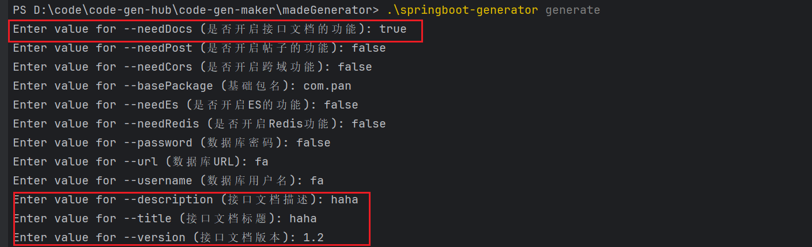

# 代码生成器平台
## 第一期 项目介绍
这一期的主要内容：了解我们要做一个怎样的项目，以及我们可以将这个项目分为几个阶段完成。这个项目可以分为三个阶段完成，第一个阶段，通过手动制作一个简单的基于命令行的代码生成器去梳理制作代码生成器的流程，梳理代码生成器包含哪些功能模块。在第二阶段，基于第一阶段梳理出来的流程，分析哪些流程是可以固定的，哪些流程是需要用户参与的，然后利用代码来实现制作代码生成器的全部流程。在第三阶段，将第二阶段制作好的代码生成器制作工具上云，通过前端界面获取需要的相关配置，最后生成一个代码生成器。
### 感触的内容
1. 进行需求分析时，我们需要调研，可以调研同类产品，可以调研相关的技术。
2. 写代码不是最重要的，比写代码重要的是，如何写更少的代码，如何提高效率。
## 第二期 项目初始化
- 在做一些复杂，庞大东西的时候需要做需求拆解
- 主要聚焦于第一阶段，手写代码生成器
- 需求拆解，拆成一个一个小的任务，可以完成的任务
    - 本地代码生成器
    - 命令行输入
- API查询：如何查看文件的修改时间以及创建时间
- 代码生成的三种场景
    - 增加代码
    - 替换代码
    - 可选代码
- 相对路径验证：有时候是相对于工作目录，有时候是相对于类文件路径
- 为什么测试框架下，访问的是基于项目的的项目路径，而真实的代码，访问的确实类文件路径下的相对路径
###第三期 命令行开发
- 遇到不会做的技术，没有使用过的框架，做充分的调研，先百度搜，然后github搜，然后问AI，不过我建议，可以先问AI
- 学习一门新技术，一定是先看官方文档，如果官方文档看不懂，我们再去看视频教程，别人写的博客
- 学技术的方式
    - 第一步：跑通入门Demo
    - 第二步：学习实用功能 以及项目需要使用到的功能
- 一个验证点：交互式输入，用户不输入，但是这个选项被标识为必需选项会怎么样呢？
- 一个小的扩展点：通过修改用户输入的args，来实现强制性交互输入
- 设计模式的核心在于应用场景
- 写程序之前，明确需求很重要
- 别人说的再多，不如自己写代码验证一下
### 主要内容
这一期的主要内容是学习命令设计模式，调研并学习Java命令行开发的框架，然后将这个框架集成到我们写的这个简单的代码生成器中，并手动打Jar包，封装脚本文件。
### 感触的内容
让我感触的内容如下：
1. 在学习一门新的技术的时候，我们第一件事情是看官方文档，跑通入门Demo即Get Starter。然后就是学习核心实用的功能（可以参考业务需求，或者询问AI）如果官方文档看不懂，才去看视频教程，问AI，看别人写的博客
2. 遇到没有接触过的技术，不熟悉的概念时，第一步我们可以利用AI，如果AI给出的东西不准确，我们再去全网搜索，如果还是不够，就可以继续看看Github上是否存在相关的项目。
3. 在动手之前，明确需求很重要，梳理出功能点，这样我们才能有目的的编写。
### 功能点列表
- [x]  完成验证点：交互式输入，用户不输入，但是这个选项被标识为必需选项会怎么样呢？
- [x]  完成扩展点：通过修改用户输入的args，来实现强制性交互输入
- [x]  集成Picocli框架到我们自己的代码生成器中
- [x]  封装命令行脚本
## 第四期 制作工具开发
- 面对一个复杂的需求，不知道如何下手时，我们可以拆需求，拆到自己会为止
    - 先跑通业务流程，然后再优化，再完善
- 当你不知道怎么做的时候，一定要去借鉴，问AI，百度，问大佬
- IDEA实用快捷键 Ctrl + Shift + R 全局替换
- 一个验证点：`ClassPathResource.getAbsolutePath()` 在jar包情况下的路径是什么？
### 主要内容
这一期主要的内容是跑通制作工具的整体流程，即制作一个固定的代码生成器。为此我们先进行了需求分析，想清楚设计思路，分析出我们要做的功能，即根据原始的项目为基础，制作出一个模板工程（包含静态文件，动态文件）然后借助这个模板工程生成代码生成器对应的代码。这是一个整体的思路，而这一期就是在假设模板工程制作完成的情况下，生成对应的代码生成器的代码，并利用程序构建Jar包，生成对应的命令行脚本文件。
### 感触的内容
1. 面对一个复杂的需求，不知道该怎么办，不知道如何下手时，我们可以拆需求，拆解需求的方式有两种，如果很明显可以纵向拆，比如基于命令行的代码生成器，就可以拆分成，命令行开发，代码生成能力开发。而如果不能很明显的拆分，就可以层层递进，即先跑通核心流程，然后优化，然后完善，最后完美。
2. 面对一个棘手的问题时，我们需要先去借鉴业界的解决方案，将其改造为适合自己业务的解决方案，或者问AI，或者问相关的大佬。
### 功能点列表
- [x]  制作工具项目初始化
- [x]  元信息定义
- [x]  制作代码生成器模板文件（数据模型文件，命令行相关文件，代码生成相关文件）
- [x]  构建Jar包
- [x]  封装脚本
## 第五期 制作工具优化
- 系统自恢复能力
- 对于异常，能定义枚举就定义枚举
- 代码圈复杂度不能高于10
### 主要内容
这一期的主要内容，主要是优化上一期写的基础版本的代码生成器，主要从四个方面进行优化
1. 可移植性优化，主要是为了保证代码生成器在任何环境都可以运行
2. 功能优化，主要是优化和完善一些功能
3. 健壮性优化，主要是为了保证无论用户如何输入，外部环境如何变化，程序都可以运行或者提供良好的提示
4. 可扩展性优化，主要是为了保证别人能够很好的修改你的代码，扩展你写的功能。主要的手段是利用设计模式，避免硬编码等等。
### 感触的内容
- 在写代码的时候，一定是先跑通，然后优化，然后完善，然后完美。好的程序是一步一步迭代出来的
### 功能点列表
- [x]  可移植性优化：将模板文件与生成器打包在一起。将生成器生成的代码放置生成器目录下
- [x]  功能优化
    - [x]  让生成器更加的规范，即生成一个使用说明。gitignore文件，能够被Git托管
    - [x]  空间优化，生成精简版本的代码生成器，即只包含模板文件，Jar包，脚本文件即可
- [x]  健壮性优化：对元信息 配置文件的校验
- [x]  可扩展性优化：让别人更好的扩展我们自己的代码，
    - [x]  尽量避免硬编码问题，即魔法值 解决：定义枚举类，定义常亮
    - [x]  流程很复杂和繁琐的时候，可以使用模板方法模式，固定流程
- [x]  验证点：Jar文件的相对路径是工作目录，而直接在Idea中运行时，相对路径是class类文件
- [ ] 疑问点：Java中什么时候使用相对路径是当前工作目录，什么时候是classpath路径？
## 第六期 配置能力增强
- 开发复杂项目时，可以先利用一个具体的例子，然后再从这个例子从抽象出通用的需求
- 分析出需求后，要给需求排期，根据难易程度排序，由简单到复杂，由通用到特殊
### 主要内容
本期的主要内容是在做能力增强，具体而言是我们制作工具制作的代码生成器的能力增强，再具体点就是**代码生成**能力的增强。之前代码生成的能力，只有一个，那就是基于数据模型生成对应的**代码内容**，不能控制文件的生成，不能根据条件生成不同的代码内容等等。而这一期就是完善这些功能。而且是在代码生成器制作工具层面做的增强，这意味着每一个由制作工具生成的代码生成器都具备这些能力，为了这些额外的功能，我们需要增加更加复杂的元信息配置。增加的功能如下：
1. 制作工具自己制作代码生成器依赖的模板文件
2. 一个数据模型的参数控制多个文件的生成
3. 一个数据模型的参数控制单个文件的生成
4. 数据模型参数支持分组
5. 数据模型参数即支持分组，也支持开启这个分组或者可以关闭这个分组
### 感触的内容
1. 从具体的例子中梳理出通用的需求（能力）
### 功能点列表
- [x]  一个数据模型的参数控制单个文件的生成
- [x]  一个数据模型的参数控制多个文件的生成
- [x]  数据模型参数支持分组
- [x]  数据模型参数即支持分组，也支持开启这个分组或者可以关闭这个分组
- [x]  `commandNormalize` 这个函数是存在问题的
## **第七期 模板制作工具开发**
- 制作工具的作用只是提高效率，无法覆盖所有的定制化需求
- 程序的本质就是帮我们完成原本人工需要进行的操作
- 针对个例编写这个个例的主流程，然后让这个主流程通用化
### **主要的内容**
这一期是整个项目中最为核心的一期，也是逻辑比较复杂的一期，主要内容：实现一个原始项目模板文件制作器，即根据原始的项目，使用这个模板制作器进行”挖坑”，制作模板文件，并生成元信息配置文件。但是模板文件的制作特别依赖用户的需求，所以我们实现的这个工具的目标不是覆盖全部的定制化需求，而是提高用户制作模板文件的效率。于是我们需要给这个模板制作工具实现下面这些能力
1. 基于简单的例子跑通整个主体流程
2. 支持工作空间，实现项目之间隔离
3. 支持连续制作，分步制作的能力
4. 支持一次制作多个模板文件
5. 文件过滤的功能
6. 支持文件分组
7. 支持模型分组
### **感触的内容**
- 当我们在基于个例实现业务的时候，先要跑通整个流程，然后再不断地添加新的功能，但是我认为在实现每个新功能之前，都需要判断一下**是否需要重构**。
### **功能点列表**
- [x]  基本流程实现
- [x]  工作空间实现
- [x]  连续制作，分步制作实现
- [x]  一次制作多个模板文件实现
- [x]  文件过滤实现
- [x]  文件分组实现
- [x]  模型分组实现
- [x]  疑问点：JSON的序列化底层是如何做的？
## 第八期 模板项目生成
### 主要内容
这一期的内容，主要是在做测试验证，以及修一些BUG，和代码优化。
### 感触的内容
1. 当我们对代码做出一些改变的时候，我们在做完一点改变之后就测试验证，如果验证通过，然后继续优化和修改。这样一小步一小步的完成，更容易修复BUG，更容易跟踪定位。
2. 当我们需要对某个方法的多个参数封装成一个参数的时候，我们尽可能的提供方法重载，从而避免修改原来的旧代码。
### 功能列表
- [x]  BUG修复：同一个配置多次生成的时候，元信息中的文件配置会被修改为静态文件
- [x]  BUG修复：制作完一次模板文件之后，再次制作，元信息中的文件配置信息中会额外存储一个动态模板文件的配置内容
- [x]  BUG修复：元信息配置文件中，文件的输入路径和文件的输出路径相反
- [x]  BUG修复：调整元信息配置文件的生成路径
- [x]  功能优化：封装参数，让模板制作工具更加的易用
- [x]  测试验证：制作出一个SpringBoot-Init的模板项目的代码生成器
    - [x]  需求1：项目基本信息
    - [x]  需求2：替换生成的包名
    - [x]  需求3：控制是否生成帖子相关的内容
    - [x]  优化点：输出规则定义，文件信息去重
    - [x]  需求4：控制是否开启跨域
    - [x]  需求5：自定义API接口文档
    - [x]  需求6：自定义MySQL配置信息
    - [x]  需求7：是否开启Redis
    - [x]  需求8：是否开启ES
- [ ]  优化点：当一个参数控制一组模型参数时，如果参数过多，不能立即输入那一组参数
    
## 第9期 云平台开发（一）
- 设计库表的方法，一定要结合自己的业务，以自己的业务需求为主，多去参考同类业务的库表设计，可以在Github上搜一搜，当然也可以问AI
- 自己写的代码要留好，多参考自己也是提高效率的大杀器
- Crtl + ALt + O 去除没有使用的import
- 自己写前端界面，直接参考对应项目的preview项目
### 核心内容
这一期的核心内容就是将我们开发完成的代码生成器“平台化”，“云化”，说人话就是开发Web前端，Web后端。这一期主要是针对代码生成器信息，以及用户信息进行了一个Web开发。实现在网页上浏览代码生成器，用户登录与注册的能力。
### 感触的内容
- 在写前端的时候，我们可以先拿到数据，然后再写页面，然后再写精修页面。
- 如果这个页面的数据源只有一个，而且会根据某些条件来动态的调整数据源的内容，我们可以使用`userEffect()` 配合**Status变量**进行数据源的动态改变。
### 功能点列表
- [x]  数据库表的设计 （用户表，代码生成器表）
- [x]  后端项目初始化 项目信息替换，项目瘦身，数据库初始化
- [x]  后端：用户功能
- [x]  后端：代码生成器功能 代码生成，数据模型开发，业务逻辑开发，测试
- [x]  前端项目初始化 30min
    1. 项目信息的修改
    2. 请求处理
- [x]  用户注册页面 20min
- [x]  管理页面 10min
- [x]  主页（搜索列表页面）40min
- [ ]  疑问点：数据库表的设计，字段名一定要求下划线吗？
- [ ]  疑问点：MyBatis-Plus like函数，多次执行like会怎么样？可以看日志，看看具体的生成SQL是什么样子的
