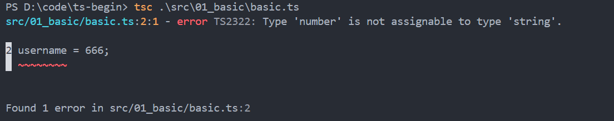
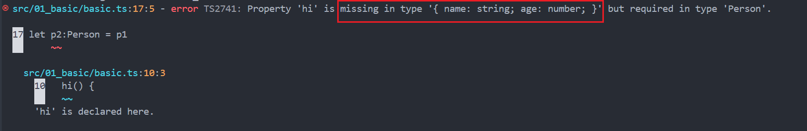

# 写给Java开发者的TypeScript入门指南
> PS：这篇文章不过是我看官方文档的HandBook有感而写，希望对你有帮助！
## TypeScript是什么？
就如标题而言，TypeScript（简称：TS）是什么？在我看来，TS是在JS的基础上增加了静态类型检查的编程语言。所以相对于JS而言，TS只是在类型上对其做了增强。那什么是静态类型检查呢？静态类型检查：在编译期间，由**编译器**负责检查类型相关的错误，比如变量的赋值，函数的传参，对象方法的调用等等。就比如下面这段代码：
```ts
let name: string = "pandaer";
name = 666;
```


你看，通过TS的编译器，我们可以在编译期间检查出来一些错误，避免这些错误发生在运行期间。这样的好处是：我们可以提前修复一些BUG，提高整体的代码质量。既然TS只是类型上的增强，那么我们就来看看TS提供了哪些类型？

## TS中的常见类型
在TS中，大致提供了如下的类型：
1. 基础类型，`string`，`boolean`，`number`
2. 数组：type[]，比如：`number[]`，`string[]`
3. 对象类型：{field1:type1,field2:type2}，比如：{name:string, age:number}
4. 联合类型：type1|type2，比如：number|string
5. 接口
在我们深入到具体细节的时候，我们需要理解TS中定义的类型，在TS中类型被看做是一个**集合**，一组对象的集合。而一个对象既可以属于这个集合，也可以属于另外一个集合。完全就是看结构是不是相似，即是不是包含了这个类型所指定的属性，比如下面这段代码：
```ts
class Person {
  public name: string;
  public age: number;

  constructor(name: string, age: number) {
    this.name = name;
    this.age = age;
  }
}

let p1:{name:string,age:number} = {name:"lll",age:1223}
let p2:Person = p1
```
这段代码是可以编译通过并没有任何报错的，其中p1的类型是`{name:string,age:number}` p2的类型是`Person`，如果从其他静态类型的语言的角度看（比如：Java），这是两个不同的类型不能互相赋值，但是TS中的类型是基于结构的而不是基于声明，只要结构满足就可以。如果我给Person类增加一个方法就不满足结构类似了。比如下面这段代码：
```ts
class Person {
  public name: string;
  public age: number;

  constructor(name: string, age: number) {
    this.name = name;
    this.age = age;
  }

  hi() {
    console.log("hi," + this.name)
  }
}

let p1:{name:string,age:number} = {name:"lll",age:1223}

let p2:Person = p1
```

通过这个例子可以看出，只要一个类型中的全部属性都可以在对象中找到，并且类型一致，那么这个对象就是这个类型的对象，这就是TS中特有的结构上满足就可以，而不需要显式的声明。


