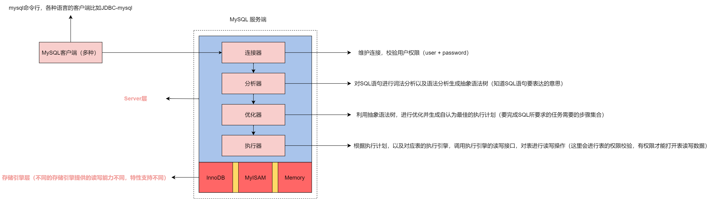
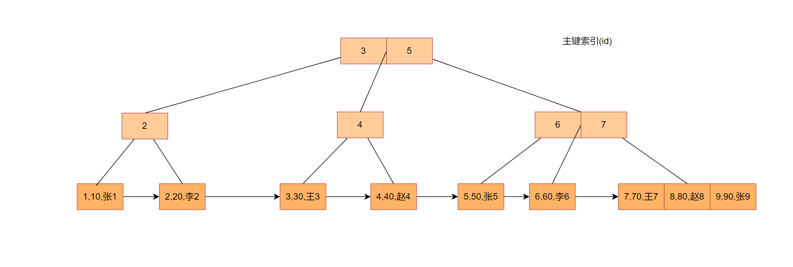
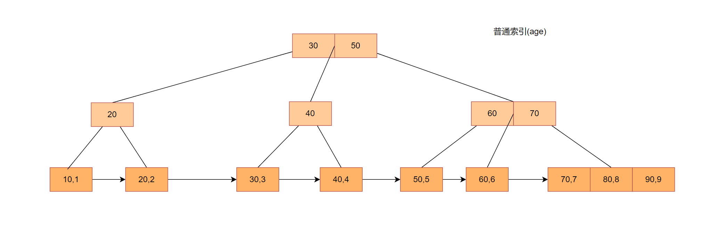
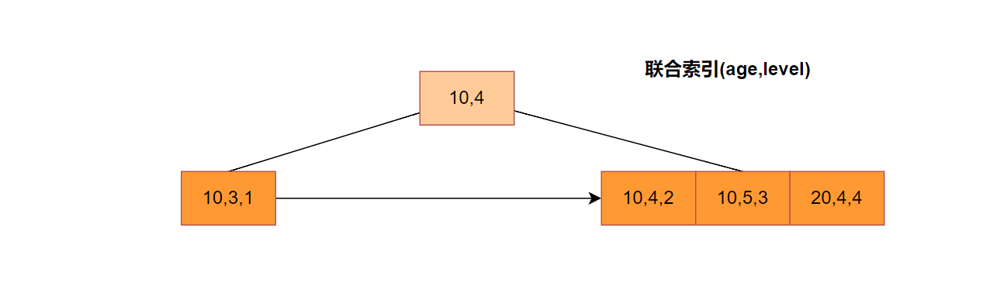

# MySQL 核心基础

MySQL一个后端开发必须会接触的中间件，也是关系型数据库的代表。如果你希望看下去这篇文章，需要你有使用MySQL或者相关关系型数据库的经验，不然这篇文章在你眼中就会索然无味了。

这篇文章不会讲解如何使用MySQL，例如如何安装？如何创建表，如何增删改查数据？如果你期望的是这样的内容，这篇文章也不适合你。

那么这篇文章讲什么呢？在此之前我想说说我学习后端中间件的思路，无论是Redis，还是ES，或者RabbitMQ。学习这种东西，我们可以分为两个维度，一个是使用者的维度，重点在于如何利用它的特点完成我们的功能。基本上都是增删改查。第二个维度就是开发者的角度，我们需要了解它的整体架构，它是如何完成一些核心操作的，就拿MySQL来说，它是如何实现数据的读写的？而这篇文章正是站在一个开发者的角度，介绍MySQL中的核心组件的。

这篇文章我会从MySQL的基础架构讲起，然后聊到MySQL中两个比较重要的日志，redo log,bin log，接着会聊聊MySQL是如何组织数据，然后会聊聊MySQL作为关系型数据库的事务以及锁功能。

## MySQL的基础架构

了解一个组件的全貌，方便我们定位问题，分析问题，也能够让我们在研究其原理的时候，不会陷入细节而白白浪费时间。下面这张图就是MySQL的基础架构图



总的来说，MySQL是CS架构，Client通过网络将SQL语句交给Server端，Server端处理之后，将数据通过网络返回给Client。我们的重点在Server端，Server端大致分为两层，一个是服务层，一个是存储引擎层。我们通过一个例子将Server端的组件串起来。例子如下

```mysql
select user_id,user_name from user;
```

假设user表只有两个字段，一个是userId,一个是username,其中userId是主键。当客户端发起查询语句的时候，流程是这样的：

1. 建立连接，客户端与连接器建立连接，连接器负责校验用户名和密码，并读取这个用户的权限作为后续的基础
2. 连接建立完毕后，连接器将SQL语句交给分析器进行词法分析以及语法分析生成抽象语法树，换句话说就是在校验SQL语句的语法是否正确，是否存在这个表，表中的字段是否存在。
3. 当分析出这个SQL语句要做的事情之后（要做什么），分析器会将这个抽象语法树交给优化器，优化器根据抽象语法树生成最佳的执行计划，换句话说就是把要**做什么** 转换为 **怎么做**。
4. 分析器将这个执行计划交给执行器，执行器会校验这个用户是否有权限操作这个表，然后打开表并利用存储引擎提供的读写接口检索数据，最后将数据返回给客户端。

相信通过上面的介绍，你对MySQL的总体结构有了一定的了解，也知道了真实操作数据的是存储引擎层中具体的存储引擎，而接下来我们会以主流的InnoDB为例介绍后续的相关内容。

查询语句的执行流程我们清楚了，那更新语句呢？

## MySQL的日志系统（待优化）

MySQL中有三种重要的日志，一个是binlog,redolog,undolog,而在这一节中，我会和你介绍binlog,redolog,至于undolog会在介绍事务的时候与你详细说说。

不过在谈日志系统之前，你需要知道一个知识，**磁盘的随机读写的IO成本大于磁盘的顺序读写IO成本，而写日志利用的是磁盘的顺序读写。**

首先我们先来看看这两种日志处于的位置，binlog位于服务层，而redolog是InnoDB存储引擎独有的。之所以是这样是由于这两种日志的作用不同。binlog也被我们称为归档日志，主要的用途是用作数据备份，主从同步。而redolog的作用是InnoDB提高更新操作性能的一个手段。我们知道磁盘的读写是同步操作，会导致阻塞。执行器在修改数据的时候，会调用存储引擎提供的写接口，如果使用的InnoDB的话，会将这个写操作记录到redolog中，然后就会返回OK，执行器就会认为修改数据成功。InnoDB利用redolog将磁盘的随机写转换为磁盘的顺序写，提高了写操作的性能。这就是redolog的一个作用。当然redolog可不止这一个作用，redolog也常常被用于MySQL的崩溃恢复，保证数据的一致性。讲完了这两种日志的作用，我们来看看它们的相同点以及不同点。

最大的相同点就是binlog与redolog都只记录更新的操作。最大的不同点就在于binlog可以一直写，而redolog是一个环形日志文件，大小固定，如果写满了会覆盖之前的更新记录。其次就是写的东西不同，binlog记录的是SQL操作，而redolog记录的更加细致一些，记录的是数据页的修改动作。多个数据页的操作才对应一个SQL操作。所以通常binlog的写时机在事务提交的时候，而redolog在事务开始的时候都会有写操作了。为了满足数据的一致性，以及binlog与redolog的逻辑正确，就出现了两阶段提交。即当事务提交的时候，先往redolog写一条日志，标志这个事务的状态为prepared，然后开始写binlog，等binlog写完之后再往redolog中写一条日志标志这个事务的状态为commit。到此这个事务才算真正的提交了。

我们通过这个例子将这两个日志串起来，例子如下：

```mysql
update `user` set `user_name` = 'pandaer' where `user_id` = 1001
```

大部分的逻辑和查询语句差不多，先建立连接，将SQL语句交给分析器，执行器执行优化器生成的执行计划。不同点就在执行器调用存储引擎提供的写接口上。当执行器找到user表中user_id等于1001的数据之后，会先在redolog中记录要在哪个数据页的哪个位置修改什么数据，然后事务提交，就会进入两阶段提交的过程，这个时候binlog就会写入这个SQL操作，最后事务结束，更新语句结束。至于数据文件的更新会由MySQL的后台线程进行刷新。

## MySQL的索引

在讨论MySQL的索引之前，我想和你聊聊索引是什么？在我看来，索引是用来快速检索和定位数据的，就像汉语字典中的目录一样，可以根据拼音首字母快速查找汉字。具体而言，索引是一种具备快速检索功能的数据结构。而快速检索的背后一定是某种算法，而衡量某种算法的好坏有两个标准，一个是时间复杂度，一个是空间复杂度。为了支持快速检索，我们应该把重点放在时间复杂度上，时间复杂度越小越好，最好是：随着数据规模的增大，消耗的时间没有显著的变化。也就是时间复杂度维持在`O(1)`或者`O(logn)`左右。

接下来让我们回顾一下 什么样的数据结构 + 什么样的算法 可以支持快速查找。一说到快速查找，相信你一定知道两种，**二分查找**，**HashTable**，**二叉查找树**。二分查找的前提是有序，所以一般和数组结合在一起使用。HashTable的查找方法是利用Hash算法快速定位。二叉查找树利用的也是二分的思想，只不过是在树上而已。

那MySQL选择的那种呢？从原理上来说，MySQL选择的是二叉查找树，那为什么没有选择其他的呢？这得和MySQL的查询需求有关，我们使用MySQL进行查询操作的时候，一般会使用定值查询以及范围查询甚至全表查询。定值查询这个需求下，HashTable最优`O(1)`，基于数组的二分查找和二叉查找树的时间复杂度为`O(logn)`所以这个需求下，HashTable胜出，但是在范围查询这个需求中，HashTable最差，需要O(n)，而基于数组的二分查找和二叉查找树仍然可以保持在`O(logn)`左右。所以综合考虑，我们也应该从基于数组的二分查找和二叉查找树中选一种出来。这个时候就不仅仅考虑查询需求了，我们使用MySQL除了查询，还有修改和新增操作。而基于数组的修改和新增时间复杂度达到了`O(n)`，而二叉查找树的插入和修改操作也维持在`O(logn)`，通过上面的分析，如果你是MySQL的设计者，你也会选择二叉查找树。

但是MySQL真正的索引结构并不是二叉查找树？这是为什么呢？那究竟是什么数据结构呢？这里我先给出答案是B+树，原因在于尽可能少的使用磁盘的随机读的能力。通过前面我们已经知道了磁盘的随机读IO成本很大。你可以计算一下，如果你有1万条数据需要索引，二叉查找树的树高是多少？假设是一颗完全二叉树,那就是 2^n - 1 = 10000求n, 大概算了一下树高为13左右。换句话说就是读取叶子节点的数据需要进行13次随机读，而随机读一般情况下都是毫秒级别的，所以最少也需要13ms，这是不能接受的。于是为了避免随着数据量的增大而导致树高有显著变化，MySQL采用了B+树，B+树是一种**平衡多叉查找树**。限于篇幅如何这里展开聊B+树的话，那么这一节就会变得很庞大，读起来的体验就不够好了。所以这里我给出一些B+树的资料方便你了解。

- B-Tree视频：https://youtu.be/K1a2Bk8NrYQ?si=EaYWp7HXpiB2QIew
- B+ Tree可视化网站：https://algo.hufeifei.cn/BPlusTree.html

### MySQL中数据即索引

在前面我花了很大的篇幅来一步一步推导出MySQL索引使用的数据结构的目的是为了告诉我们，数据结构和算法不仅仅是在刷题的时候才能用到，程序中的世界充满的数据结构和算法的美，去研究这些比较偏底层的原理的时候，数据结构和算法是你的一大助力。

如果你还没有来得及了解B+树，那么你需要记住三个特点

1. 叶子节点都在同一层
2. 叶子节点通过链表的形式串联在一起
3. 叶子节点内部按照一定的顺序存储着数据。

在MySQL中数据依托在一个索引上，我们把这个索引称为聚簇索引，数据都在叶子节点内部。一张表必须有一个聚簇索引，而索引的字段就是表结构中定义的主键。而其他非主键索引，叶子节点记录的就是主键的ID。我们通过两个例子来看看这两种索引的区别

假设我们有一种User表，表结构如下

```mysql
create table user (
	id int primary key,
	age int,
	name varchar(32),
	index idx_age (age)
)
```






上面这两张图分别是主键索引的B+树结构图，以及普通索引的结构图。

场景1：当我们通过下面这个查询语句进行查询的时候：

```mysql
select * from user where id = 1;
```

因为id是主键，所以使用主键索引，根据B+树的查找算法找到对应的数据并返回。

场景2：当我们使用下面这个语句查询的时候：

```mysql
select * from user where age = 20;
```

因为age不是主键，又有age的索引，所以会利用普通索引进行查询，在普通索引上通过B+树的查找算法找到数据(20,2)，这个数据只包含了id和age,并不包含name,所以需要使用id的值，也就是2，在主键索引中再查找一遍，这个过程被称为**回表**。

场景3：但是当我们使用下面这个查询语句的时候，就不需要回表了。

```mysql
select id,age from user where age = 20;
```

过程一样，只不过找到对应的数据(20,2)之后与用户要求的数据一致，可以直接返回。

在日常的使用过程中，我们应该尽可能**减少回表**，来提高数据库的查询性能。

### 联合索引

单个字段索引的内容基本上聊完了，接下来我们来看看多个字段组成一个索引的场景。在这种场景下，MySQL给我们提供了三种优化机制，一种是**最左匹配原则**，可以减少一些索引的维护，一种是**覆盖索引**，可以减少回表次数，一种是**索引下推**，可以减少回表的次数。我们先来看看最左匹配原则

#### 最左匹配原则

最左匹配原则讲的是，在进行条件查询的情况下，进行索引选择的时候，如果条件中的字段与联合索引中的字段符合最左匹配，那么这次查询就可以使用这个联合索引，进行快速的检索，否则就只能全表扫描了。当然不仅仅是字段，如果是字符符合最左匹配也可以使用联合索引。举个例子

比如这种会员表：

```mysql
create table member (
	id int primary key,
    name varchar(255),
    age int, 
    level int, -- 会员等级
    index idx_age_level (age,level)
)
```



当我们使用下面的查询语句时：

```mysql
select * from member where age = 10
```

在查询的时候，age字段与(age,level)联合索引符合最左匹配，所以可以使用这个索引进行快速检索。

但是如果是下面这个查询语句：

```mysql
select * from member where level = 4
```

在查询的时候，由于level字段与(age,level)联合索引不符合最左匹配，所以就不能利用这个联合索引做快速检索。

注意：使用索引，分为两种，一种是使用索引进行**全扫描**，一种是使用索引进行**范围查询**。我们通常意义上的使用索引就是希望借助索引进行范围查询，提高查询效率。

除此之外，如果联合索引的数据满足用户要求的数据就不需要回表，这就是**覆盖索引**，比如下面这个查询语句

```mysql
select id,age,level from member where age = 10;
```

这个时候通过联合索引获取的数据就是(10,3,1)，(10,4,2)，(10,5,3)，而这些数据满足查询语句的要求，索引就不需要回表获取name字段相关的数据了。

最左匹配原则以及覆盖索引我们知道了，我们接下来看看索引下推是怎么回事？

#### 索引下推

索引下推是更加细粒度的减少回表次数，我们来看下面这个例子

```mysql
alter table member add index (name,level);

select * from member where name like '张%' and level = 10;
```

由于这个条件查询语句针对name字段使用了模糊匹配，然后又符合最左匹配原则，所以会使用联合索引(name,level)，在进行数据扫描的时候，当某条记录的name字段符合模糊匹配的原则，就会额外判断一下level的值是否等于10，只有等于10的数据才会被回表，如果不等于10，就会舍弃这条数据。但是在MySQL5.6之前，不会额外判断level的条件是否满足，而是直接拿着符合name字段的数据回表，在回表的过程中再判断。

到此，MySQL中索引相关的内容基本上都聊完了。接下来我们来聊聊MySQL中的锁。

## MySQL的锁

锁是实现并发控制的一种手段，也是讲解事务的基础。但是在MySQL中锁的类型太多了，不可能通过这一节就全部覆盖，所以我决定从锁的粒度出发，从大到小介绍几种常见的锁。所限

首先粒度最大的锁是全局锁，它所针对的对象是一个库，当给一个库上锁之后，我们就不能进行写操作，只能进行读操作了。

其次就是表级锁，表级锁分为两类，一类是控制数据的锁，一类是控制表结构信息的锁，也被叫做元信息锁（MDL）。举个例子，当需要读取某个表数据的时候，会先判断是否有元信息写锁，如果没有，就会上元信息读锁，然后再上一个读数据的读锁，之后才能开始在这张表上读数据。执行更新语句也是一样，先上元信息读锁，再上写数据写锁。一旦存在修改表结构的操作就会上元信息写锁，读写互斥，所有对数据的操作都会被**阻塞**。

最后就是行锁，不过行锁也是InnoDB 存储引擎独有的，针对的是每一条数据。行锁的注意点：**两阶段锁协议**，具体而言就是在执行某个语句前上锁，在事务结束后解锁，而不是在语句执行完。可以理解为：**解锁是有延迟的**。

使用锁最需要注意的是死锁问题，不过MySQL有死锁检测机制，如果存在死锁问题会自动回滚一个事务，来接触死锁。因为两阶段锁协议的存在，我们需要再业务上，把最容易发生竞争的资源往后放，靠近事务提交的时间节点。

这就是最基本的锁内容，至于间隙锁，意向锁等等，需要你自己去了解，去研究，可能后续的内容中也会有所介绍。

## MySQL的事务

关系型数据库规定的事务需要满足ACID，A：原子性，C：一致性，I：隔离性，D：持久性。我们像记顺口溜一样记住了ACID，但是这四者不是一个层级的东西。在我看来，一致性是目的，原子性，隔离性，持久性是手段。我们通**过保证事务的原子性，隔离性，持久性来实现数据的一致性**，或者叫数据的正确性。

我们这一节聊聊MySQL的事务是如何实现的，这里先给出答案：MVCC + 锁。MySQL通过MVCC + 锁机制实现了高性能的事务机制。说到事务，我们最容易想到的就是隔离级别：

1. 串行化
2. 可重复读
3. 读已提交
4. 读未提交

串性化的实现就是加锁，而读未提交就是不加锁。而可重复读以及读已提交利用了MVCC以及锁。那到底什么是MVCC呢？

### MVCC

MVCC 全称Multi-Version Concurrency Control，中文翻译多版本并发控制，简单来说就是通过一个数据多个版本的手段来进行并发控制，是一种并发控制的手段，最重要的是MVCC是无锁算法，无锁算法就意味着性能好。但是MVCC只能用于**读操作**。如果同时有两个写事务在竞争同一个数据资源也同样会使用锁来进行并发控制，即一个事务写，另一个事务等待。我以可重复读的隔离级别为例来讲解MVCC的工作机制。

在一个事务中，当我们执行第一条SQL语句的时候，MVCC 会对整个数据库进行一次 “快照”，然后这个事务中所有的查询操作都是基于这个快照来完成的。所以在这个事务中，对于同一个查询的SQL语句多次执行可以得到相同的结果。不过这个“快照”并不是真的拷贝一份数据，而是利用undolog + 一个数据存在多个版本来实现的。在一条记录中，不仅仅存放的真实的数据，还存在一个`row trx_id` 也就是修改这条记录的事务ID。再利用undolog，我们就只保留最新的数据，然后通过undolog找到之前的旧版本。

不过MVCC这种机制只能用于读操作，如果是写请求，比如插入操作或者更新操作就只能通过行锁，获取到当前最新的数据，并以这个最新的数据进行修改而不是快照中的数据，我们把这个操作称为**当前读**，如果一个事务在对一行数据进行更新操作，而另外一个事务也要对这一行进行更新操作，那么这个事务就会因为没有获取到锁而被阻塞。所以MVCC + 锁实现事务的方案相对于SQL规范中的只利用锁实现事务的方案在一个事务读，一个事务写的场景能够提升性能。而读读，写写这两个场景帮助不大。

## 总结

呼~~，我们从MySQL最基础的架构聊起，最后聊到了MySQL最核心的事务实现。其中可能会有一些不对的地方，如果你发现了，你可以在评论区指出，我们共同讨论！最后，我们江湖再见！

## 推荐阅读

1. MySQL实战45讲 基础篇
2. [凤凰架构  本地事务](https://icyfenix.cn/architect-perspective/general-architecture/transaction/local.html)


