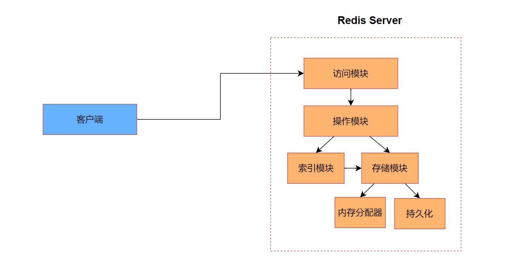
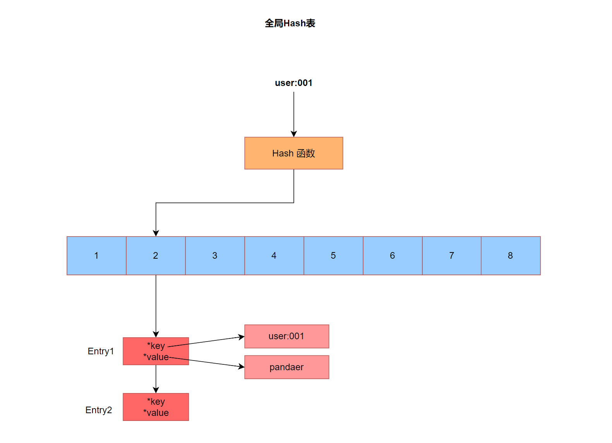
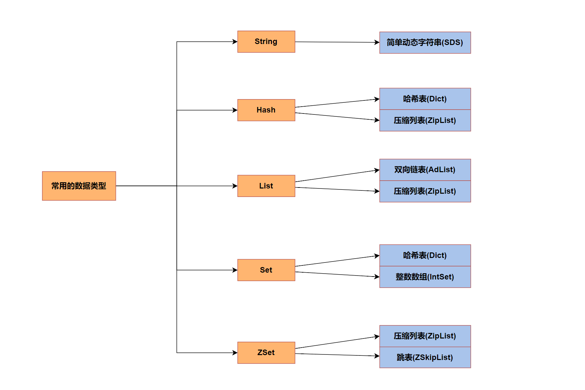

# Redis 核心基础

Redis作为后端开发的重要性仅次于MySQL，为什么它如此重要呢？我认为的一个原因就是它作为缓存时，可以显著的提高服务的性能。另一个原因就在于不同于MySQL固定的应用场景，Redis的应用场景非常的多样化，比如可以用作缓存，可以基于Redis构建分布式锁，可以基于Redis构建分布式会话，甚至可以基于Redis构建一个简单的消息队列等等。我之前有强调过，学习中间件要有两个视角，一个是使用者的角度，学会利用中间件解决业务上的问题，主要可以通过应用场景以及经典的案例来学习和使用。另一个是开发者的角度，去理解中间件的架构设计，核心功能原理，这样可以很好的帮助我们在使用过程中出现问题，帮助我们**定位问题，解决问题**。

这篇文章正是站在一个开发者的角度来介绍Redis的一些基础功能的实现原理。因此食用这篇文章的前提就是你需要有使用Redis的使用经验。如果没有，那么这篇文章你读起来会索然无味。

我们通常称Redis是一个**基于内存**的**键值型**数据库。所以我们会从一个键值型数据库的基础架构讲起，然后接着聊聊Redis性能好的两个原因，一个是丰富的值类型，另一个是高效的IO模型。然后会接着聊Redis的持久化机制，然后继续聊Redis的分布式的功能，一个是主从同步，一个是分片集群。

## 单机键值型数据库的基础架构



这是一个简单的单机键值型数据库的基础架构，而Redis不过是在此基础上增加了分布式相关的特性，而分布式相关的特性与数据如何读写的逻辑关系不大。

看上图我们知道，Redis整体上也是采用了CS架构，我们的重心仍然放在Server端上。客户端与服务端的交互逻辑如下：

1. 客户端与访问模块建立连接，这里包含了身份校验
2. 建立连接之后，访问模块将客户端传递过来的指令交给操作模块
3. 操作模块负责解析指令，验证其正确性，并将这个指令中对应的key交给索引模块
4. 索引模块利用key，并利用存储模块提供的相关的API，快速定位值对应的位置，并将这个位置返回为操作模块
5. 操作模块根据值对应的存储位置，利用存储模块对其进行增删改查

对Redis整体的架构有了一定的理解之后，我们接着聊聊Redis高性能的两个原因，一个是丰富的值数据类型，一个是高效的IO模型。我们先从丰富的值数据类型开始

## 高性能之丰富的值数据类型

丰富的值数据类型可以更加高效的存储值。但是针对key的数据类型就没有那么丰富了，只有一种数据类型那就是字符串。不过在详细聊聊值的数据类型之前，我们需要先看看索引模块。索引模块的作用就是用于快速检索数据的，索引的底层数据结构与具体的查询需求有关，而Redis的查询需求只有等值查询 即使用指定的key查询到对应的值。等值查询最优的数据结构是Hash表，它的时间复杂度是O(1)，所以理所当然Redis的索引模块的具体实现也借助了Hash表。具体可以看下图



 一个key经过Hash函数会被映射到对应的Hash桶中，图中是映射到2号桶，然后会将对应的key以及value打包成一个Entry,而对应的key,value都是指针，即具体数据的内存地址，所以Entry的内存大小固定。由于无论是什么操作都需要借助这张Hash表，所以这张Hash表也被称为**全局哈希表**。

我们对数据的操作说到底都是针对value的操作，所以一条指令执行效率取决于value的操作效率，而value的操作效率与value的数据类型有关。而value的数据类型在背后都有其多种实现，理解其实现的读写效率即**时间复杂度**和**空间复杂度**，有助于我们选择合适的数据类型，提高指令的执行效率。

在Redis中常用的数据类型有5种

1. String    字符串类型
2. Hash     哈希表类型
3. List        列表类型
4. Set         集合类型
5. ZSet       有序集合类型

这5中常用的数据类型有不同的实现，具体如下图



可以看到底层的数据结构有

1. 简单动态字符串
2. Hash表
3. 压缩列表
4. 双向链表
5. 整数数组
6. 跳表

如果我们深入Redis的源码中去了解这些数据结构的操作代价，那么这篇文章的篇幅就会变的很大，不方便食用，所以这里我只简单说明一些这些数据结构的操作代价，至于更加细节的内容会在后面的文章中呈现。

首先我们来看看简单动态字符串（Simple Dynamic String）简称：SDS，之所以会出现这个数据结构是源于Redis是用C写的，而C提供的原生字符串其实本质上是一个字符数组，针对某些操作的代价过高，也不支持动态扩容。所以Redis就自己提供了一个字符串的实现。针对**获取字符串长度的操作**时间复杂度O(1),也支持**动态扩容**。如果你是JavaCoder那么这个字符串的实现就和Java中字符串的实现类似。

如果你还没过瘾可以看看这些资料

- https://redis.io/docs/latest/operate/oss_and_stack/reference/internals/internals-sds/
- Redis源码中的sds.c,sds.h文件

然后我们接下来看看Hash表,这个和我们在数据结构中学习的Hash表一样，定值查询的时间复杂度O(1)

然后就是压缩列表，压缩列表是双向链表的一种特殊实现，我们只需要知道它极致的优化内存的占用就好了。而双向列表的POP操作和PUSH操作都能够达到O(1)

接下来我们看看整数数组，当Set中存储的全是数字的时候，就会使用整数数组来实现以此来节省内存

如果你不熟悉跳表这个数据结构，可以点开这个链接玩一玩：https://algo.hufeifei.cn/SkipList.html 总的来说跳表这个数据结构通过不断的升维，来提升查找效率，从链表的O(n)提高到了O(logn)，除此之外，跳表的数据是按照一定的顺序排列的。所以即便是范围查询也能够达到O(logn)的水平

到此我就简单的聊了聊Redis常用数据类型对应的底层数据结构，以及这些数据结构的操作代价。接下来我们就来聊一聊Redis高效的IO模型

## 高性能之高效的IO模型

> 基于Redis6.0之前的版本，Redis6.0之后的版本后面更新

IO模型有三种，分别是BIO（阻塞式IO），NIO（非阻塞式IO），AIO（异步IO）,而Redis采用的NIO，但是在聊NIO之前，我们需要理解BIO，不过我们聊BIO之前，我们需要补充一个知识点，这里IO模型针对的是**网络IO模型**而非文件IO。

BIO指的是在进行读操作或者写操作的时候，整个线程会被阻塞，等待数据。而NIO指的是在进行读操作和写操作的时候，整个线程不会被阻塞，会返回读操作或者写操作的结果，表示是否读取到数据，是否写入数据。一般NIO都会和**轮询**配合使用。所谓的轮询对应到代码中就是循环，大致如下：

```java
while(true) {
    Result res = readWithNio();
    if (res.status != -1) {
        break;
    }
}
InputStream in = res.getInputStream();
// IO操作...
```

而Redis利用NIO + 多路复用机制实现了在一个线程中同时处理多个连接的IO请求。这种机制需要操作系统内核来帮忙，由操作系统内核负责轮询多个连接，判断连接目前处于的状态，是可连接？还是可读？还是可写？然后在Redis中利用操作系统内核提供的API，获取对应状态的连接集合，并针对这些连接集合进行IO操作处理。

```java
while (true) {
	int count = selector.select(); //  获取处于可读，可写，可连接的连接对象
	if (count <= 0) continue;
    List<SelectKey> keys = selector.keys();
    for (key : keys) {
        if (key.isRead()) {
            // 读操作...
        }else if (key.isWrite()) {
            // 写操作...
        }else if (key.isConnected()) {
            // 连接相关的操作...
        }
    }
}
```

Redis正是采用了NIO + 多路复用模型才能实现单线程处理IO也能保持高性能。而且单线程天然就没有资源竞争的问题，也避免了多线程的上下文切换。所以Redis在处理连接，执行操作使用**单线程**也能保持很好的性能。

想要更好的理解这一节的内容，需要你有NIO的使用经验，如果你是JavaCoder，那么Java提供的NIO相关的API，可以学习学习。

我来谈谈我对BIO以及NIO的理解，在我们使用BIO处理网络IO的时候，我们不得不用一个线程来管理网络连接，然后再利用线程池去执行具体的操作，类似下面这样：

```java
while (true) {
	ServerSocket ss = new ServerSocket(8080);
    Socket socket = ss.accpect(); // 阻塞式等待
    Thread thread = ThreadPool.getThread();
    thread.runTask(socket);
}
```

这段代码的逻辑就是，每次来一个连接，我们就会将这个连接交给一个额外的线程处理。这就是BIO的处理逻辑，而NIO的处理逻辑是从始至终都是使用一个线程来处理多个连接，而至于连接的管理交给了操作系统内核来做。

如果你想更加深入的实践NIO，你可以学习[Netty](https://netty.io/)相关的内容。

## 高可用之持久化模块

未完待续…

## 高可用之主从复制

未完待续…

## 高可扩展之分片集群

未完待续…


