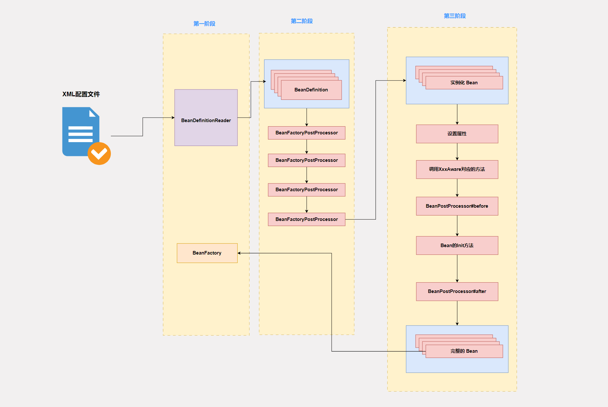

# Spring 源码

探究技术的本质，享受技术的乐趣！在Spring核心篇中，我介绍了我眼中的Spring，并着重阐述了我理解的IOC以及AOP，这篇文章主要是自己阅读源码之后的一些收获以及一些总结。

## 在官方文档消失不见的架构图


在最新的Spring官方文档中，这张架构图已经不见了。我们需要借助这张图去理解Spring有哪些重要的组件。这里我来一一介绍一下，我们从下往上看

1. Test模块 最基础的模块，主要用于集成一些单元测试框架
2. Core Container部分主要包含4个模块，其中最重要的莫过于Beans，因为Beans模块中有IOC容器最基础的实现`BeanFactory`，而Context模块是我们最容易接触到的，典型的代表就是`ApplicationContext`。`ApplicationContext`也是一个IOC容器，它的IOC容器的能力依赖Beans模块，除此之外，它还提供了国际化，资源管理的功能。可以这样说，`BeanFactory`只是一个基础容器，而`ApplicationContext`是一个高级容器，有很多其他的实用功能
3. AOP模块，是Spring对AOP编程模型的落地，而Aspects是对使用最广泛的AOP框架AspectJ的一个集成
4. 至于更加上面的模块，就是我们耳熟能详的了，就不一一介绍了。

和我在核心篇中说的一样，Spring最核心的两个功能就是IOC以及AOP。所以在阅读源码的时候，我们也应该将大部分的精力放在IOC以及AOP的具体实现上。

## Spring中的IOC太庞大了

Spring关于IOC的实现经过这么很多个版本的迭代，现在已经是巨无霸了。我们应该怎么寻找阅读源码的入口呢？嘿嘿，先别急，在看源码之前，我们先对齐一些认知。在Spring中，被IOC容器管理的对象称为Bean对象。所以IOC中核心的逻辑就是Bean是如何创建的？Bean的生命周期如何？在Bean创建的过程中需要哪些组件参与进来？

我们借由这三个问题来弄清楚IOC的具体逻辑。首先我们先来看看第一个问题

### Bean是如何被创建的？

让我们回到Spring1.0时代，那个时候是2003年，Java的注解还没诞生。我们不能像现在这样通过几个简单的注解（`@Service`,`@Component`）就能告知哪些类型的对象需要交给Spring管理。那个时候用的是基于XML配置文件的方式，比如像下面这样

```xml
<bean id="userService" class="com.pandaer.UserService"/>
```

相信在学习Spring的早期，你一定学过这样的方式。但是Spring是一个Java框架，管理的也是Java对象。所以Spring一定会去解析这么一个XML配置文件，然后根据配置文件的配置创建出对用的Bean对象。所以我们就需要有一个对象可以存储这些配置信息，即这个Bean的名字，这个Bean对应的类型等等信息。而在Spring中存储这类配置信息的类是 `BeanDefinition` 这个时候，我们就大概就可以猜出来Spring是如何创建Bean对象的了。先解析XML配置文件，解析bean标签的属性，将解析好的属性封装成一个一个`BeanDefinition`对象。然后根据`BeanDefinition`对象中的信息创建出一个Bean对象。这是我们能够想到的思路，值得开心的是，这也是Spring创建Bean对象的主体逻辑，如果抛开Spring在创建Bean对象的前后阶段埋的Hook函数的话，那么这个过程就已经大致完整了。至于详细的`BeanDefinition`的信息，可以参考[API文档](https://docs.spring.io/spring-framework/docs/current/javadoc-api/org/springframework/beans/factory/config/BeanDefinition.html) 

### Bean对象的生命周期

如果你学过Vue,那么Bean对象的生命周期就好理解了，在Vue中的组件的生命周期，我们不仅要了解组件到达某个生命周期的特点，还需要知道这个状态前后的Hook函数，比如`onMount` ，Bean对象的生命周期也不例外，我们需要理解两方面的东西，一方面是生命周期中各个状态的特点，一方面是Spring给我们提供的Hook函数。Bean的生命周期我认为大致如下：

1. 实例化
2. 设置属性值 依赖注入
3. 调用指定的初始化方法
4. 完整的Bean对象
5. 容器关闭，调用指定的销毁方法

而Spring提供的Hook函数，主要有两类，一类是XXXAware接口，一类是各种`BeanPostProcessor`接口。针对XXXAware接口，如果我们的创建出的Bean对象实现了XXXAware接口，就会在**设置属性值之后**调用这个接口中定义的方法，比如常见的`ApplicationContextAware`，至于`BeanPostProcessor`，我们通常称为Bean的后置处理器，这个后置处理器存在两个方法，一个是Before，一个是After，分别在**调用指定的初始化方法**前后执行。值得注意的是，Bean对象的后置处理器其实是一个列表，我们可以通过实现Order接口来指定顺序。

### 在Bean创建的过程中需要哪些组件参与进来？

我们了解Bean元信息的解析过程，以及Bean对象的创建过程，现在我们将其串联起来，整个过程就是IOC的全流程了。

在Spring中我们既可以通过XML配置来管理Bean对象，也可以通过注解的方式管理，甚至两者皆可，但无论是哪种我们都需要解析外部数据（解析XML，解析注解）这里我们需要使用Spring抽象的第一个组件`BeanDefinitionReader` ，通过这个Reader将Bean元信息都封装到`BeanDefinition`对象中，然后将这些`BeanDefinition`对象放在`BeanFactory`的一个Map中，在通过利用`BeanDefinition`对象创建出Bean对象之间，Spring提供了一个Hook函数，这个函数在`BeanFactoryPostProcessor`中，主要的责任是负责动态添加或者修改一些`BeanDefintion`对象。然后就会实例化一个Bean对象（就是调用了默认构造器），目前的Bean对象不完整，接下来就是设置Bean对象中的属性，这个过程也叫做依赖注入，然后需要判断当前Bean对象有没有实现XXXAware接口，实现了就需要调用其中的方法，然后执行`BeanPostProcessor#before`方法，然后调用Bean对象中指定的初始化方法，然后执行`BeanPostProcessor#after`方法，到此刻Bean对象就完整了，如果这个Bean对象的配置是一个单例，那么就会将这个对象放入`BeanFactory`的单例池中（也是一个Map）。最后，当容器关闭时，即调用了`close`方法，就会调用Bean对象中定义的销毁方法。

这就是Spring中IOC的核心流程，至于一些细枝末节，就得需要你自己跟踪一下源码了。下图是是IOC完整的流程图



## 未完待续...


