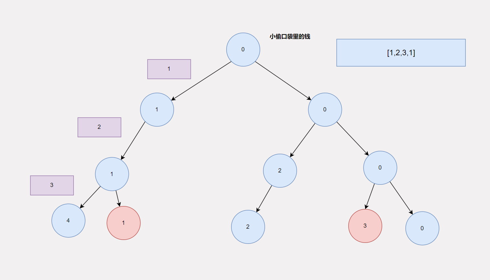

# 动态规划

算法很简单！今天我们来聊聊动态规划，我们先从动态规划怎么来的讲起，然后聊聊动态规划应该如何学？最后正式开始动态规划的学习之旅。

## 动态规划怎么就出现了呢？

存在即合理，动态规划的出现一定是为了解决一些问题的？那是解决什么样的问题呢？在我看来动态规划是一种优化手段，如果你了解过一点动态规划，就一定听说过这样一句话，“能用动态规划解决的问题，一定可以用回溯解决”。没错，在我的认知中，**动态规划是回溯的某些情况下的优化算法**。那是哪些情况呢？学过回溯之后，我们知道回溯的核心是**构建一个多阶段决策树**，树的每一层代表一个阶段，这一层的节点代表了这一层的决策选择，但是这些决策选择有可能是重复的，也有可能是冗余的，但是回溯可不管这些即便是重复的也会继续往下决策，这样就有一些重复或者冗余决策，这就导致了回溯的时间复杂度比较高。而动态规划优化的就是这类情况。即 “回溯 + 重复/冗余子状态 = 动态规划”。

到此，我们知道了回溯出现的原因，接下来就来聊聊学习动态规划的正确姿势，既然动态规划是针对某些特定情况的优化，那么只要我们能够记住这些特定的情况，那么在遇到这些特定情况的时候，就知道需要使用动态规划了。没错，就是**记特殊情况**，说的高大上一点就是**记模型**，从整体上看，这些在这些特定情况下的问题，一般都是**可行问题，计数问题，最值问题**。**可行问题**，需要我们判断某种状态是否可达。**计数问题**，需要我们给出到达某种状态有多少种可能。**最值问题**，需要我们给出到达某种状态，最大代价或者最小代价。但是在具体的模型下，这些问题的解法也有不同。我认为的模型有

1. 背包模型
2. 路径模型
3. 打家劫舍&股票买卖模型
4. 爬楼梯模型
5. 匹配模型
6. 其他模型

像我们这样的初学者，我们最应该掌握的是前5种模型，尤其是1,3,5模型，最重要的当属第一种模型，在学习具体的模型之前，我们先来看看动态规划的基本解题步骤

## 动态规划也很死板？

大致的解题步骤是这样的，如果这个问题可以用回溯解决，而且在回溯的过程中存在重复/冗余的状态就可以用动态规划。具体而言

1. 判断这道题是否可以分阶段解决
2. 画出这道题的决策树
3. 从决策树中分析出状态
4. **定义状态**
5. **给出状态转移方程**
6. 给出代码

在这6个步骤中，相对而言第4,5步是我们不熟悉，也是比较困难的，尤其对于新手而言。所谓的定义状态，就是明确在整个决策过程中，存在哪些不同的选择。而状态转移方程，表达的是当前阶段的状态如何通过之前的状态通过一定的加减乘除运算到达。虽然这两步比较困难，但是他们很固定，基本上就是上面那5个模型。所以**掌握模型，吃定动态规划**。

## 掌握好模型，动态规划不用愁？

我们应该怎样学习这些模型呢？建立映射关系并能举一反三。举个例子，比如你看到一个问题，你能够将这个问题抽象为一个模型，并记住以及理解了在这个模型下的状态的定义，以及状态转移方程的推导，然后解决这个问题。就算掌握了这个模型。所以掌握模型的秘诀就是：**不断总结，多多练习**。所谓总结就是做完一道题之后，思考一下这道题的特点，以及这道题的特点和哪个模型比较像。接下来我们来仔细看看具体的模型吧

## 掌握好背包模型，动态规划就成功了一半

需要总结出背包模型，我们需要从一些经典的题目开始。

> 假设有一个背包，可承载的最大重量为`w` 千克。现在有 `n` 个物品，每个物品的重量`weights[i]（0<=i<n）`不等并且不可分割。任选几件物品装入背包，是否能装满背包？
>
> ```shell
> 输入：
> 10
> 6
> 3 1 4 6 9 12
> 
> 输出：
> true
> 
> 解释：
> 输入的第一行为w，第二行为n，第三行为n个物体的重量
> 4+6=10 因此可以装满背包。
> ```

***

阅读这道题目，我们可以分析出这是一道**可行问题**，满足利用动态规划解题的题目第一个特点。然后我们先忘记动态规划，看看如何用回溯来解决这个问题，并简单的画出决策树。你可以动手试试，这里我先给出**我的思路**，首先我们需要知道如何分阶段，这里我选择根据物品是否被选择来分阶段，即每个阶段决策这个物品是否在背包中，然后判断一下，在放入物品之后，是否装满背包，如果知道物品决策完毕之后，也没有满足装满背包，那么就可以确定这些物品不能装满背包。我们可以根据这个思路画出一个决策树。如下图：


这里我只画了前三个阶段，可以看到当决策4这个物品放不放入背包之后，存在两个相同重量的节点，如果再往下面进行决策的话，这两个节点对应的子树一定是一样的。这个就是重复的状态。

根据前面所讲的动态规划的内容，我们知道这道题可以用回溯来解决了，那么我们就可以开始来定义状态了，定义状态，一般情况下是执行某个操作之前或者之后，某个东西的情况。就比如上面这个思路，就是在决策一个物品是否放入背包后，背包的重量。这里**背包的重量**就是我们寻找的状态。我们定义状态的时候，必须定义**完全**并需要标识这种状态是否可达。比如这里，我们的状态时背包的重量，那么粗暴一点，背包重量的取值就为：[0,n] ，即每次决策完之后，背包的重量都有[0,n]这n+1种可能，所以我们可以利用一个二维数组来表示状态，i表示第i个物品决策之后,j表示当前背包的重量，`arr[i][j]` 的值表示在第i个物品决策完之后，背包重量为j的这种状态是否可达。到此状态我们就定义完成了，接下来看看状态转移方程，即如何基于前面的状态推导出现在的状态。这里就需要根据决策来推导，通常是反推，比如这里，当我们要判断`arr[i][j]` 这个状态是否可达时，我们需要这样想，要想到达这个状态，我们能够执行的操作之后两个，一个是**选择**了第i个物品的，一个是**没有选择**第i个物品，我们可以一个一个看，我们先看选择了第i个物品后，背包的重量到达了j，那么基于的上个阶段一定是`arr[i-1][j-weight[i]]` 即上一个阶段，背包重量为`j-weight[i]` ，同理，如果没有选择第i个物品，那么一定是基于`arr[i-1][j]` 这个状态推导过来。我们通过具体的**决策操作**知道了`arr[i][j]`依赖于哪些个之前的状态。然后我们就可以看看如何根据之前的这些状态推导出现在的状态，这个要具体问题具体分析，对于这个可行的问题，推导方程当然是 `arr[i][j] = arr[i-1][j] || arr[i-1][j-weight[i]]` 即只要上一个阶段中，背包重量为j可达，或者背包重量为 j-weight[i]可达，就可以推导出当前阶段，背包重量为j可达。

总结一下上面的过程，首先我们先通过决策树知道了可以利用动态规划来解决问题，然后我们根据决策之后，某些个属性的发生了变化，而且每个阶段这些属性都会变化，比如背包重量。我们就知道了我们选择哪个属性作为状态，确定好状态之后，我们需要列举出**状态的所有的可能**。状态定义完成之后，我们可以根据具体的操作逆推当前的状态和之前哪些个状态相关，并根据题意构造出推导方程，这个推导方程就是状态转移方程。状态转移方程有一个很明显的特点，那就是一定是基于**之前的状态**（准确的说应该是已有的状态）推导过来的。

到这里呢，思路我们就梳理完毕了，那么就可以进入最后一步，写代码。

```java
public class Code01_Solve_Knapsack {

    /**
     * 定义状态 dp[i][j] :表示在第i个物品决策之后，当前背包的重量为j这个状态是否可达
     * 状态转移方程 dp[i][j] = dp[i-1][j] || dp[i-1][j-weights[i]]
     *
     * @param w
     * @param n
     * @param weights
     * @return
     */
    public boolean solveKnapsack(int w, int n, int[] weights) {
        // 定义状态
        boolean[][] dp = new boolean[n][w + 1];

        // 初始化 DONE 因为boolean值默认就是false，自动完成

        // 设置初项
        dp[0][0] = true;
        if (weights[0] <= w) {
            dp[0][weights[0]] = true;
        }

        // 填表 根据状态转移方程
        for (int i = 1; i < n; i++) {
            for (int j = 0; j <= w; j++) {
                dp[i][j] = dp[i - 1][j];
                if (j - weights[i] >= 0) {
                    dp[i][j] = dp[i][j] || dp[i - 1][j - weights[i]];
                }
            }
        }

        // 返回结果
        return dp[n - 1][w];
    }
}
```

可以看到从思路到代码还是有点不一样的，有一定的改变，不过整体的思路总是一样的。当然目前这段代码的空间复杂度还是比较高的，后面会讲解动态规划的空间优化来优化这段代码的空间复杂度。

从这段代码中我们可以总结出一个代码模板

```java
public int dpSolve(args) {
    // 定义状态
    // 初始化
    // 设置初项
    // 填表 根据状态转移方程
    // 返回结果
}
```

到此呢，背包模型就讲完了，但是背包模型还有一些变种，比如完全背包问题，有限背包问题。我讲的这个是0-1背包问题，分析思路和具体的解题套路都没有变，唯一的区别就是使用的物品个数有一定的改变，比如完全背包问题，就是使用的物品个数不限，有限背包问题就是使用的物品个数有限，0-1背包问题就是使用的物品个数只有一个。

当你理解完这道题之后，就代表你成功入门了动态规划，而且也知道了背包模型，接下来就是练习有关背包模型的相关题目了。具体如下：

1. [分割等和子集](https://leetcode.cn/problems/partition-equal-subset-sum/)

2. [目标和](https://leetcode.cn/problems/target-sum/)

3. [零钱兑换](https://leetcode.cn/problems/coin-change/)

4. [零钱兑换 II](https://leetcode.cn/problems/coin-change-ii/)

## 路径模型真的很简单？

接下来我们来介绍第二个DP模型：路径模型，同样的我们先看[一道题](https://leetcode.cn/problems/minimum-path-sum/description/)，从题目中总结模型的特点。

> 给定一个包含非负整数的 `m x n` 网格 `grid` ，请找出一条从左上角到右下角的路径，使得路径上的数字总和为最小。
>
> **说明：**每次只能向下或者向右移动一步。
>
>  
>
> **示例 1：**
>
> 
>
> ```
> 输入：grid = [[1,3,1],[1,5,1],[4,2,1]]
> 输出：7
> 解释：因为路径 1→3→1→1→1 的总和最小。
> ```
>
> **示例 2：**
>
> ```
> 输入：grid = [[1,2,3],[4,5,6]]
> 输出：12
> ```

按照之前的套路，我们得先确认这道题可以利用回溯来解决，然后我们再来思考选择那个属性作为状态，然后再确定状态转移方程。同样的，我们一步一步来

第一步：这道题可以利用回溯来解决吗？答案肯定显而易见，毕竟这是一篇讲解动态规划的文章😂，但是应该如何分析呢？回溯的关键是构建多阶段决策树，在这道题就是向下走还是向右走，走完了之后，下一个阶段的决策需要依赖当前阶段决策的状态，最后到达终点后，统计结果。根据题目的意思，你会发现一个现象，无论怎么走，都会距离终点近一步。而总共只需要 `m+n-1` 步就可以到达终点。所以我们可以分为`m+n-1`个阶段，然后利用回溯求解。

第二步：我们知道这道题可以利用回溯来解决问题，那么接下来我们需要选择一个属性作为状态，我说过一般而言是选择进行决策之后的属性作为状态，当我们做完向左走还是向右走后，我们当前的状态为在`grid`中的某个位置`(x,y)` 然后思考我们能不能知道这个属性在全部阶段的所有的可能。很明显我们知道，不就是`grid`中的每个格子吗？于是我们的状态就出来了，`dp[i][j]` 表示当处于`grid`中`(i,j)`位置时的最小代价值

第三步：推导状态转移方程，这个状态转移方程很容易推导，要么是从上面来（向下走），要么是从左边来（向右走）所以状态转移方程为：`dp[i][j] = Math.min(dp[i-1][j],dp[i][j-1]) + grid[i][j]`

当你梳理完成这三步之后，那么就可以写代码了。参考代码如下

```java
class Solution {
    public int minPathSum(int[][] grid) {
        // 定义状态
        int row = grid.length;
        int col = grid[0].length;
        int[][] dp = new int[row][col];

        // 初始化 DONE 

        // 设置初项
        dp[0][0] = grid[0][0];
        for (int j = 1; j< col;j++) {
            dp[0][j] = dp[0][j-1] + grid[0][j];  
        }

        for (int i = 1; i< row;i++) {
            dp[i][0] = dp[i-1][0] + grid[i][0];
        }

        // 填表
        for (int i = 1; i < row;i++) {
            for (int j = 1; j < col;j++) {
                dp[i][j] = Math.min(dp[i-1][j],dp[i][j-1]) + grid[i][j];
            }
        }

        // 返回结果
        return dp[row-1][col-1];
    }
}
```

现在我们来对比路径模型和背包模型，背包模型很明显就是**一个阶段一群状态**（背包的重量），而且所有可能的状态在每个阶段是一样的。而路径模型没有那么一板一眼，而是知道了**全部阶段所有可能的状态**。

知道了路径模型，接下来就是开练，多多练习，从练习中寻找感觉，也是一种学习之道。

1. [LCR 166. 珠宝的最高价值](https://leetcode.cn/problems/li-wu-de-zui-da-jie-zhi-lcof/)
2. [120. 三角形最小路径和](https://leetcode.cn/problems/triangle/)
3. [62. 不同路径](https://leetcode.cn/problems/unique-paths/)
4. [63. 不同路径 II](https://leetcode.cn/problems/unique-paths-ii/)

## 别具一格的打家劫舍&股票模型？

接下来要介绍的模型和前面的两种模型有着不小的差别，我们需要细细体会其中的不同。废话不多说，[上题](https://leetcode.cn/problems/house-robber/description/)！

> 你是一个专业的小偷，计划偷窃沿街的房屋。每间房内都藏有一定的现金，影响你偷窃的唯一制约因素就是相邻的房屋装有相互连通的防盗系统，**如果两间相邻的房屋在同一晚上被小偷闯入，系统会自动报警**。
>
> 给定一个代表每个房屋存放金额的非负整数数组，计算你 **不触动警报装置的情况下** ，一夜之内能够偷窃到的最高金额。
>
> **示例 1：**
>
> ```
> 输入：[1,2,3,1]
> 输出：4
> 解释：偷窃 1 号房屋 (金额 = 1) ，然后偷窃 3 号房屋 (金额 = 3)。
>      偷窃到的最高金额 = 1 + 3 = 4 。
> ```
>
> **示例 2：**
>
> ```
> 输入：[2,7,9,3,1]
> 输出：12
> 解释：偷窃 1 号房屋 (金额 = 2), 偷窃 3 号房屋 (金额 = 9)，接着偷窃 5 号房屋 (金额 = 1)。
>      偷窃到的最高金额 = 2 + 9 + 1 = 12 。
> ```
>
>  
>
> **提示：**
>
> - `1 <= nums.length <= 100`
> - `0 <= nums[i] <= 400`

根据题意，我们很容易就分析出了这是一道**最值问题**，然后就可以思考是否可以利用回溯解决，进一步思考是否可以利用动态规划解决。这里我们肯定是知道了这道题可以利用动态规划来解决，接下来用我提供的三步走思考模板来思考。

第一步：**判断是否可以利用回溯解决问题？**再一次强调，回溯的核心：构建多阶段决策模型。于是我们可以按照这样的思路来解决问题，我们可以按照是否偷来分为阶段，有多少个房子就分为多少个阶段，根据题目的条件限制，我们可以画出这样的多阶段决策树



你可以倒回去看看，这棵决策树和背包模型那棵决策树有什么不同？即**上一步的决策影响了下一步的决策选择列表**。说人话就是**上一步的决策会导致下一步的某些决策不能做**。

第二步：**选择哪个属性作为状态？**通常而言是选择决策之后的某个属性作为状态，但是这道题由于每个阶段的可选择的决策不一样，即有些阶段只能选择偷，而有些阶段既可以选择偷也可以选择不偷。所以当我们列举出全部状态的可能的时候，就不得不分类讨论了。即做出偷决策的所有可能的状态，做出不偷决策的所有可能的状态。在这里我们选择在决策一个房间之后，小偷口袋中的钱作为状态。因为不同的决策有不同影响，所有我们需要分类讨论即`dp[i][0]` 表示在第i个房间选择不偷的时候，小偷口袋中最大的金额，`dp[i][1]`表示在第i个房间选择偷的时候，小偷口袋中最大的金额。

第三步：推导状态转移方程！由于状态被分类了，所以状态转移方程也会被分类。即 `dp[i][0] = Math.max(dp[i-1][0],dp[i-1][1])` 另一个是 `dp[i][1] = dp[i-1][0] + nums[i]`  最后的结果是：`Math.max(dp[n-1][0],dp[n-1][1])`

当你分析完三步状态之后，就可以按照这三步中的思路给出对应的代码了。参考代码如下

```java
class Solution {
    public int rob(int[] nums) {
        // 定义状态
        int n = nums.length;
        int[][] dp = new int[n][2];
        // 初始化 DONE

        // 设置初项
        dp[0][0] = 0;
        dp[0][1] = nums[0];

        // 填表
        for (int i = 1; i< n;i++) {
            dp[i][0] = Math.max(dp[i-1][0],dp[i-1][1]);
            dp[i][1] = dp[i-1][0] + nums[i];
        }

        // 返回结果
        return Math.max(dp[n-1][0],dp[n-1][1]);
    }
}
```

好了现在到了对比时刻，打家劫舍模型&股票模型与背包模型最大的不同就在于决策树的不同，即**当前阶段决策之后的状态影响了下一个阶段的可以决策的操作列表**。所以需要分类讨论。

**题目列表：**

1. [213. 打家劫舍 II](https://leetcode.cn/problems/house-robber-ii/)
2. [337. 打家劫舍 III](https://leetcode.cn/problems/house-robber-iii/) （选做）
3. [714. 买卖股票的最佳时机含手续费](https://leetcode.cn/problems/best-time-to-buy-and-sell-stock-with-transaction-fee/)
4. [309. 买卖股票的最佳时机含冷冻期](https://leetcode.cn/problems/best-time-to-buy-and-sell-stock-with-cooldown/)


## 暂时完结...

到了这里我们已经搞定了三个模型，一定有6个模型，我们完成了一半，但是爬楼梯模型很简单，还需要详细聊聊的就是匹配模型，但是如果你有这三个模型的基础，可以尝试自己做做那些相关的题目。我可以骄傲的说，如果你搞定了这三个模型以及通用的解决思路，你能独立完成80%的题目了，以及看懂100%的题解。这对于这篇文章而言就够了，之后后面的三个模型，我会在后面补上的。

**题目列表：**

- 爬楼梯模型
  1. [70. 爬楼梯](https://leetcode.cn/problems/climbing-stairs/)
  2. [322. 零钱兑换](https://leetcode.cn/problems/coin-change/)
  3. [LCR 131. 砍竹子 I](https://leetcode.cn/problems/jian-sheng-zi-lcof/)
  4. [LCR 165. 解密数字](https://leetcode.cn/problems/ba-shu-zi-fan-yi-cheng-zi-fu-chuan-lcof/)
  5. [139. 单词拆分](https://leetcode.cn/problems/word-break/)
- 匹配模型 （较难）
  1. [1143. 最长公共子序列](https://leetcode.cn/problems/longest-common-subsequence/)
  2. [72. 编辑距离](https://leetcode.cn/problems/edit-distance/)
- 其他模型 （有难度）
  1. [300. 最长递增子序列](https://leetcode.cn/problems/longest-increasing-subsequence/)
  2. [437. 路径总和 III](https://leetcode.cn/problems/path-sum-iii/)

温馨提示：针对DP新手而言，后面两个模型没有必要深入学习，可以在熟练前三个模型之后再去研究，毕竟动态规划日常开发用的不多，主要还是面试，笔试中。正如八二定律一样，掌握20%的核心内容就好


