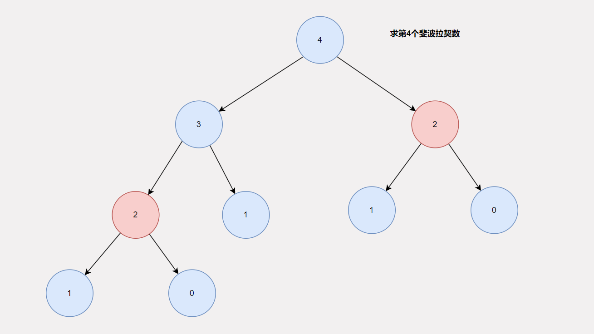
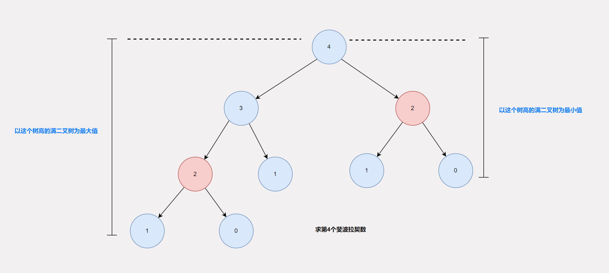

# 分治与递归

这一期的文章，我们来聊聊分治与递归，分治和递归听着这么高级，其实内容很简单，毕竟谁比想要一个高大上的名字呢？但是值得注意的是，虽然内容简单，但是递归算是一道分水岭，是判定你是否入门算法的一个标准，如果你掌握了递归，那么你的基础算法就算入门了，即便后续的回溯，动态规划，深度优先搜索都不是问题。所以递归是一个**即简单又重要**的东西。

## 简单又实用的分治谁不爱呢？

分治无处不在，是一种做事的方法论，准确的说是一种解决问题的方法论。分治可以归纳为四个字：**分而治之**。听着很高深，其实和我们经常听到的，“大事化小，小事化了”的思路差不多。总体而言就是，将一个大的问题，拆分成若干个可以解决的小问题，然后我们将小问题解决，并利用小问题的结果去拼凑大问题的结果。这就是分治的本质思想。在这个过程中，将大问题拆分成小问题被称为**递**，将若干个小问题的解拼凑为大问题的解被称为**归**，当你学习到归并排序的时候，就会深有体会。

## 递归不过是一种语法现象

递归从本质上来说，不过是在一个函数内部调用其他函数的一个**变体**，即**在函数自己的内部调用自己**。这种现象经常出现在用分治的思想解决问题的代码中。也正因如此，在代码中，分治和递归分得也没有那么清楚了，人们在谈论用递归解决问题，其实说的是用分治解决问题。毕竟分治才算得上一种算法。

## 构建递归树，就可以抓住递归的本质？

前文已经说过了，在我们的日常交流中，递归就是分治，分治也是递归，两者密不可分。如题而言，虽然说的是递归，其实说的是分治。要想抓住分治的**关键**，前提是**理解递归树**。

那么什么是递归树呢？其实就是将大问题拆分成小问题的一张关系图，由于关系图像一棵树，所以被叫做递归树。毕竟是一张关系图，光用语言描述显得有些苍白了，我们先看一道[题](https://leetcode.cn/problems/fei-bo-na-qi-shu-lie-lcof/description/)，然后看看这道题所对应的递归树。

> **斐波那契数** （通常用 `F(n)` 表示）形成的序列称为 **斐波那契数列** 。该数列由 **0** 和 **1** 开始，后面的每一项数字都是前面两项数字的和。也就是：
>
> ```
> F(0) = 0，F(1) = 1
> F(n) = F(n - 1) + F(n - 2)，其中 n > 1
> ```
>
> 给定 `n` ，请计算 `F(n)` 。
>
> 答案需要取模 1e9+7(1000000007) ，如计算初始结果为：1000000008，请返回 1。

借着说明递归树的目的，顺便将给出我自己如何判断某个问题适合用递归解决，以及如何用递归解决。

说是用递归解决，其实用的是分治的思路。而使用分治的思路需要满足三个条件

1. 解法与数据规模无关。无论什么解法都应该做到这点，不然就是针对特定的数据给出特定的解法不够通用，分治也是如此。
2. **若干个小问题的解可以推导出大问题的解**。这才是分治的核心，比如这道题，如果我要求解`F(n)`的值是多少，根据题意`F(n)`的值是由n前两个数之和给出的，所以就可以利用`F(n-1)` 以及 `F(n-2)`进行相加得到结果。这里的小问题只要比原问题数据规模小即可，至于小多少无所谓。
3. **存在最小子问题即特殊情况**。这是递归的终止条件，即当小问题的规模达到这个终止条件，我们是可以直接给出结果，不需要任何计算与推导。

通过这三步，通过第2个条件就可以判断出这道题是否可以用递归解决，遵循这三个步骤，就可以很快写出递归代码。比如下面这样

```java
class Solution {
    public int fib(int n) {
        return fib_r(n);
    }
    public int fib_r(int n) {
        if (n == 0) return 0;
        if (n == 1) return 1;
        int part1 = fib_r(n-1) % 1000000007;
        int part2 = fib_r(n-2) % 1000000007;
        return (part1 + part2) % 1000000007;
    }
}
```

这是一段符合题意的代码，但是却过不了评测，评测给出的结果是超出时间限制，为什么呢？我们先来看看递归树。



这就是递归树，可以看到递归树中存在相同的非叶子节点，这就意味着以这个节点为根的子树会被重复计算，例子给的是第4个斐波拉契数，很小，只需要推理两步就可以得到结果，但是如果是100呢？可以想象的是将会有很多**重复计算**。为了解决这个问题，我们可以使用备忘录模式，也可以在某些情况下使用动态规划。下面这段代码就是使用备忘录模式，说白了就是加了一个缓存。

```java
class Solution {
    int[] cache;
    public int fib(int n) {
        cache = new int[n+1];
        return fib_r(n);
    }
    public int fib_r(int n) {
        if (n == 0) return 0;
        if (n == 1) return 1;
        if (cache[n] != 0) return cache[n];
        int part1 = fib_r(n-1) % 1000000007;
        int part2 = fib_r(n-2) % 1000000007;
        cache[n] = (part1 + part2) % 1000000007;
        return cache[n];
    }
}
```

## 递归唯一比较难的点就在复杂度分析上

递归其实比较难得地方在于复杂度的分析，尤其是时间复杂度的分析，但是这里的前提是没有掌握递归树，如果你掌握了递归树，那么分析时间复杂度也是分分钟的事情。为什么这样说呢？我们以上面那道题的递归树为例


借助递归树进行时间复杂度分析的时候，我们只需要分析出每一个节点在递的过程的时间复杂度以及在归的过程的时间复杂度，针对这道题而言，在递的过程，无非就是一些简单的判断，时间复杂度O(1), 在归的过程中，也就是我们需要假设`fib_r(n-1)` 与 `fib_r(n-2)` 已经返回了结果之后的时间复杂度，由于这两个函数都已经返回，后面的计算不过是一些算术运算，时间复杂度也是O(1),然后经过分析发现递归树上的每个节点都得出了这样的结论，所以总的时间复杂度就是这些节点的时间复杂度之和，假设有k个节点，那么时间复杂度就是O(k), 但是时间复杂度是需要和一个数据规模挂钩的，这里就是`n`,那么就需要知道n与k的关系。这道题比较遗憾，我们无法确定n与k的准确关系，但是可以得出k的一个范围。即以最左边的叶子节点为最后一层构建的满二叉树的节点个数为最大值，以及以最右边的叶子节点为最后一层构建的满二叉树的节点个数为最小值。如下图所示：



至于具体的范围，不过是一个等比数列求和，就留给你自己了。

到此为止，有关分治与递归的东西我就讲解的差不多了，纯粹的递归很简单，分治下的递归也很容易，比较麻烦的其实是回溯下的递归以及动态规划。除了最基本的理论讲解，我们也应该多多练习才是，毕竟实践出真知

1. [LCR 127. 跳跃训练](https://leetcode.cn/problems/qing-wa-tiao-tai-jie-wen-ti-lcof/)
2. [面试题 08.01. 三步问题](https://leetcode.cn/problems/three-steps-problem-lcci/)
3. [LCR 123. 图书整理 I](https://leetcode.cn/problems/cong-wei-dao-tou-da-yin-lian-biao-lcof/)
4. [LCR 141. 训练计划 III](https://leetcode.cn/problems/fan-zhuan-lian-biao-lcof/)
5. [LCR 142. 训练计划 IV](https://leetcode.cn/problems/he-bing-liang-ge-pai-xu-de-lian-biao-lcof/)
6. [LCR 134. Pow(x, n)](https://leetcode.cn/problems/shu-zhi-de-zheng-shu-ci-fang-lcof/)
7. [面试题 08.05. 递归乘法](https://leetcode.cn/problems/recursive-mulitply-lcci/)


