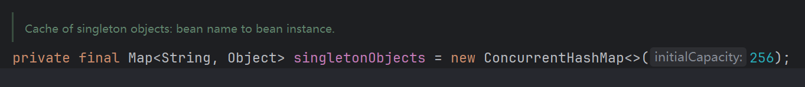

# Spring 核心

这篇文章，我们换个思路来学习，来践行一下**以终为始**，以面试题为引来重温一下Spring，毕竟孔子曾说，“温故而知新，可以为师矣。” ，可以通过这个链接看看有哪些常见的面试题

[Spring 面试题 - 面试鸭 - 程序员求职面试刷题神器](https://www.mianshiya.com/bank/1790683494127804418)

面试题虽然很多，但是如果我们抓住Spring的本质，那么一切都显得有迹可循。如果你能静下心来通读Spring的官方文档，那么你就会觉得一切都是那么自然。所有的答案都在**文档和源码**中。所以这部分内容，我替代不了你，你需要自己通读一遍官方文档。这篇文章主要是对核心的内容做一个总结仅此而已。

# Spring IOC

Spring中最基础的组件莫过于IOC容器，在聊IOC容器之前，我们先来看看IOC是什么？IOC是*Inversion of Control* 翻译为中文为控制反转，名字不重要，重要的是理解IOC的思想。在面向对象的软件设计中，一切皆对象，对象与对象之间存在依赖关系，一个功能往往需要多个对象互相配合才能实现。举个例子，用户下单这个功能，就需要订单服务与商品服务相互配合，在用户下订单之后，订单服务就会增加一个有关这个用户的订单，商品服务也会将对应的商品库存进行扣减，换句话说完成这个功能，需要订单服务对象，商品服务对象。而对象往往需要创建之后，甚至进行一些初始化操作才可用。如果将这类对象创建以及初始化的代码和业务代码**耦合**在一起，随着项目的扩展，整个工程就将变得难以维护。而IOC就是来解决这个问题的，即将对象创建以及初始化的代码与业务代码**隔离**开来。让开发人员可以更加关注业务代码，减轻开发人员的负担。而Spring IOC容器只不过是这种思想的一种实现。

那么问题来了，Spring IOC容器是如何将对象的创建与业务代码隔离的呢？这就不得不提出Spring中的另一个概念了，Spring Bean，Spring Bean就是被IOC容器管理的对象。而Bean的创建是基于一系列的配置，这些配置可能来自于XML配置文件，也可能来自Java代码。目前常用的配置Bean的方式是利用Java代码。具体而言就是我们熟知的这些注解 `@Component` `@Service` `@Controller` 以及 `@Bean` 

举个例子方便大家理解，比如下面这段代码

```java
@Service
public class StoreServiceImpl implements StoreService {
    @Override
    public Object findByName(String name) {
        return "Mock Account";
    }
}
```

当Spring启动的时候，会扫描指定包下的全部class文件，如果扫描到有关Bean配置的注解，比如这里的`@Service` 就会创建一个`BeanDefinition`对象，这个对象对应的就是Bean的元信息，换句话说就是Bean的配置信息，然后Spring就可以根据这些配置信息创建出一个Bean对象来，也就是这里的`StoreServiceImpl` 对象。至于BeanDefinition的具体配置信息可以参考这个类**GenericBeanDefinition**

对象是创建完毕了，那么这些对象应该放在哪里呢？答案是在一个Map中，这也就是为什么IOC容器中有容器这两个字了。



这个Map就是存在Spring创建Bean对象的地方，这样子的容器有三个，这里先不讨论。

既然IOC容器负责管理对象，那么对象之间的依赖关系也需要IOC容器来解决，这就是我们常说的依赖注入即DI。而依赖注入最常见的问题就是依赖循环。场景的依赖循环场景有这样三个

1. 对象A依赖对象B，对象B依赖对象A
2. 对象A依赖对象B，对象B依赖对象C 对象C依赖对象A
3. 对象A依赖对象A

Spring的IOC容器其实解决了大部分的依赖循环的问题，具体的解决办法就是利用上面提到的那三个容器。也被叫做Spring的三级缓存。但是需要注意的是，出现依赖循环，这个问题是设计上的问题，所以如果出现依赖循环，我们应该想想如果改造设计，而不是指望Spring来帮我们解决。

要说在Spring中可以和IOC容器这个特点相提并论的就只有Spring AOP了。

# Spring AOP

AOP是一种编程范式，和面向对象编程一样，它的名字叫做面向切面编程，其本质其实是**代理模式**的运用。比如，在API的管理中，有些API只有级别比较高的用户才能使用，那么我们不得不进行权限校验，这类代码在每个API中都会使用，如果让这些代码与业务代码写在一起，就会过于耦合。而AOP就是将这类通用逻辑的代码与变化较多的业务代码隔离开来。大部分的AOP实现都是使用代理模式实现的。Spring AOP也不例外，使用的是基于类的动态代理，而不是Java标准库自带的基于接口的动态代理。更加详细的内容可以参考官方文档 https://docs.spring.io/spring-framework/reference/core/aop.html ，正如我之前提到的那样，如果你有时间，你一定要去通读Spring的官方文档，你一定会收获颇多。

Spring提供了很多好用的特点，可以简化我们的开发，比如，声明式事务，异步任务，条件注解，事件驱动模式等等。但是这些特点都是基于IOC容器以及AOP来实现的。所以彻底理解Spring IOC和Spring AOP的内容很重要。

如果你时间不充裕，我也推荐你读一读Spring官方文档中IOC以及AOP相关的内容

[The IoC Container :: Spring Framework](https://docs.spring.io/spring-framework/reference/core/beans.html)

[Aspect Oriented Programming with Spring :: Spring Framework](https://docs.spring.io/spring-framework/reference/core/aop.html)