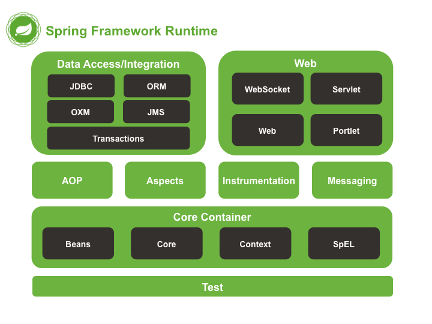

# Spring 源码

探究技术的本质，享受技术的乐趣！在Spring核心篇中，我介绍了我眼中的Spring，并着重阐述了我理解的IOC以及AOP，这篇文章主要是自己阅读源码之后的一些收获以及一些总结。

## 在官方文档消失不见的架构图



在最新的Spring官方文档中，这张架构图已经不见了。我们需要借助这张图去理解Spring有哪些重要的组件。这里我来一一介绍一下，我们从下往上看

1. Test模块 最基础的模块，主要用于集成一些单元测试框架
2. Core Container部分主要包含4个模块，其中最重要的莫过于Beans，因为Beans模块中有IOC容器最基础的实现BeanFactory，而Context模块是我们最容易接触到的，典型的代表就是ApplicationContext。ApplicationContext也是一个IOC容器，它的IOC容器的能力依赖Beans模块，除此之外，它还提供了国际化，资源管理的功能。可以这样说，BeanFactory只是一个基础容器，而ApplicationContext是一个高级容器，有很多其他的实用功能
3. AOP模块，是Spring对AOP编程模型的落地，而Aspects是对使用最广泛的AOP框架AspectJ的一个集成
4. 至于更加上面的模块，就是我们耳熟能详的了，就不一一介绍了。

和我在核心篇中说的一样，Spring最核心的两个功能就是IOC以及AOP。所以在阅读源码的时候，我们也应该将大部分的精力放在IOC以及AOP的具体实现上。

## Spring中的IOC太庞大了

Spring关于IOC的实现经过这么很多个版本的迭代，现在已经是巨无霸了。我们应该怎么寻找阅读源码的入口呢？嘿嘿，先别急，在看源码之前，我们先对齐一些认知。在Spring中，被IOC容器管理的对象称为Bean对象。所以IOC中核心的逻辑就是Bean是如何创建的？Bean的生命周期如何？在Bean创建的过程中需要哪些组件参与进来？

我们借由这三个问题来弄清楚IOC的具体逻辑。首先我们先来看看第一个问题

### Bean是如何被创建的？

让我们回到Spring1.0时代，那个时候是2003年，Java的注解还没诞生。我们不能像现在这样通过几个简单的注解（`@Service`,`@Component`）就能告知哪些类型的对象需要交给Spring管理。那个时候用的是基于XML配置文件的方式，比如像下面这样

```xml
<bean id="userService" class="com.pandaer.UserService"/>
```

相信在学习Spring的早期，你一定学过这样的方式。但是Spring是一个Java框架，管理的也是Java对象。所以Spring一定会去解析这么一个XML配置文件，然后根据配置文件的配置创建出对用的Bean对象。所以我们就需要有一个对象可以存储这些配置信息，即这个Bean的名字，这个Bean对应的类型等等信息。而在Spring中存储这类配置信息的类是`BeanDefinition`

# 未完待续...


