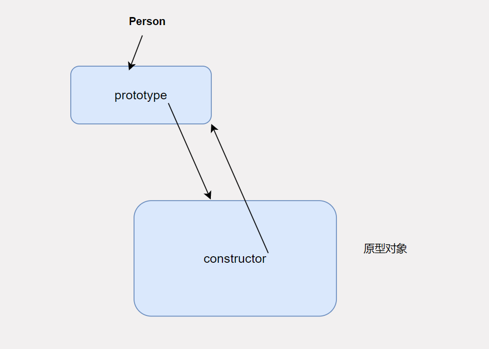
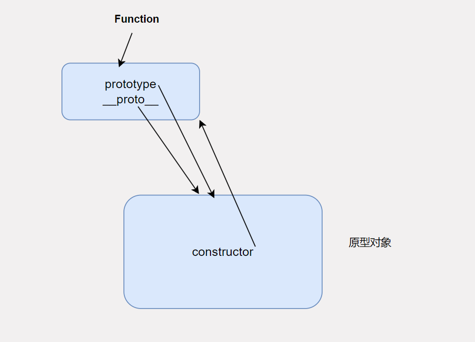

# 别样的面向对象 JS原型

欢迎来到技术漫谈的第0期，这一期我们来聊聊与我们这种后端Coder所认知的面向对象的另一种表现形式。没错，基于原型的编程其实是面向对象的一种。

我们都知道面向对象有三大特性：继承，封装，多态。无论是那种特性，在我看来不过都是在提高代码的复用率只不过是侧重点不同而已。对于继承而言，通过父子关系让子类可以复用父类的属性和方法。对于封装而言，可以将一段经常使用的代码进行封装，无论是封装成一个函数也好，还是封装成一个对象也罢，本质还是在提高这段代码的复用率。而多态从表象来看是，不同的对象同一个方法有着不同的行为，这又何尝不是一种代码复用呢？

在我看来，只要一个编程语言具有这三大特性就可以被称为是一门面向对象的编程语言。尤其是在动态的面向对象的语言中，针对具体的实现有了两种看法，一种是传统的面向对象即有class的概念，一种是基于原型的面向对象即没有class的概念。这两种孰优孰劣不予评价，这一期我们就来看看基于原型的面向对象，以JavaScript为例。

## 一个例子

我们通过一个例子来看看，如何利用原型实现对象的继承。

```javascript
let a = {name:"pandaer",age:19}
let b = {school:"大学"}
b.__proto__ = a

console.log(b.name)
b.name = "bobo"
console.log("update",b.name)
console.log(a.name)

// 输出结果:
//pandaer
//update bobo
//pandaer
```

如果你简单的了解过JS，这段代码理解起来应该没有压力，在这段代码中，我先创建了一个对象a,然后创建对象b,让b的原型指针指向a,即`b.__proto__ = a` ，当我们第一次输出b.name,因为在b对象中不存在name属性，所以就会从原型对象中查找即从a中查找，然后就找到了name属性，就输出name对应的值。接下来当我们使用`b.name = "bobo"` 就会在b对象中创建一个属性，并将这个属性赋值为"bobo",然后再次输出，按照上面介绍的逻辑，就可以在b对象中找到属性name了，就可以直接输出了就不需要在原型对象中查找了。

如果你理解了上面的代码，那么你是否觉得这有点像继承呢？`b.__proto__ = a` 是否在说对象b的父类是对象a呢？如果你对JS很熟悉，那么就一定听说过这样一道面试题：“JS中`__proto__` 与 `prototype`的区别？” ，接下来我们就借着这个面试题展开接下来的讨论。

## `__proto__` 与 `prototype` 到底有什么区别呢？

理解这个问题，有几个先决条件，在JS中一切函数都是对象。在JS的文档中提到，对象有两种表现形式，一个是基于`Object`，一种是基于`Function`，基于`Object`的形式就是上面的代码的样子，但是会比较规范一点。而基于`Function`的形式，如下面这样：

```js
function Person(name,age) {
    this.name = name;
    this.age = age;
}

const p1 = new Person("pandaer",19)

console.log(p1)

// 输出结果：
// Person { name: 'pandaer', age: 19 }
```

同样的，这段代码很简单，我们定义了一个Person函数，然后利用一个new关键字创建了一个对象。然后我们输出了这个对象，这个对象有两个属性，和我们在Person函数中定义的一样。这里的Person函数有另外一个名字叫做**构造器**。没错就是我们理解的那个构造器，主要用于初始化对象。

而我们常常念叨的`prototype`是每个函数的属性，prototype是一个对象，对象中有一个属性`constructor` 这个属性的类型是一个函数，而且刚好指向Person这个函数。可以用下面这段代码验证

```js
function Person(name,age) {
    this.name = name;
    this.age = age;
}

console.log(Person.prototype.constructor === Person)

// 输出结果：
// true
```

关系图如下：



而至于`__proto__` 这个属性是每个对象都有的私有属性，而在JS中，函数也可以是对象，所以如果我们以对象的视角看函数的，函数也应该有`__proto__`属性，没错，我们可以这样认为，我们定义的函数都可以通过`Function`构造函数创建出来，看下面的代码：

```js
// function Person(name,age) {
//     this.name = name;
//     this.age = age;
// }

let Person = new Function("name","age","this.name = name;this.age = age;")

let p1 = new Person("pandaer",19)
console.log(p1)

// 输出结果:
// anonymous { name: 'pandaer', age: 19 }
```

从这段代码中，我们不难推理出Person对象与Function函数的关系，Person对象的`__proto__`指向Function函数的`prototype` ，而Function函数的`prototype.constructor`同样指向自己。

但是如果我们将这个逻辑用于Function函数呢？似乎就陷入了先有鸡还是先有蛋的问题。Function对象从哪里来的呢？如果我们不知道Function对象从哪里来的，我们就不知道Function对象`__proto__`指向谁。针对这个问题，JS规定了，因为Function是一个根函数，所以Function对象的`__proto__` 与 Function函数的`prototype`所指向的对象一致。如图：



有了以上的基础，我们就可以回答标题上的问题了。`__proto__`是对象的私有属性，代表这个对象的原型对象，因为JS中万物皆对象（包括函数），所以函数中也会存在`__proto__` 这样的属性。又因为函数自带一个属性，即`prototype` 主要的作用是，当将这个函数当做构造器的时候，创建出来的对象的原型对象就是`prototype`所指向的原型对象。

这期技术漫谈到此就结束了，以后每周都会尽量有一期技术漫谈，主要是扩展自己的知识面，涨涨知识。如果你有任何疑问，欢迎点击右上角的Github图标提Issue！


 

