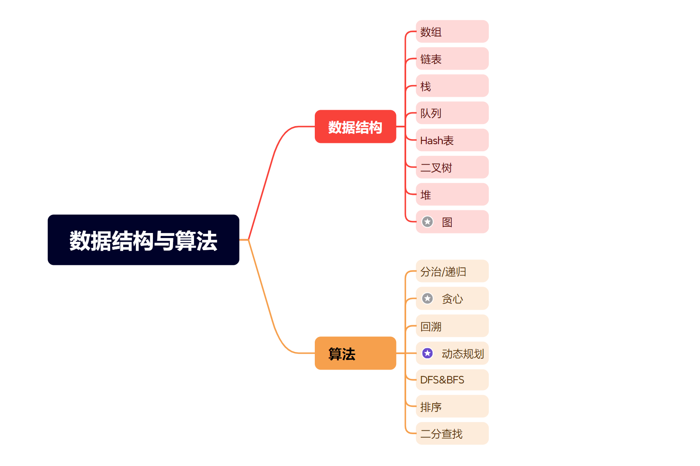

# 前言

提到数据结构和算法，我心里其实是畏惧的，因为我尝试很多次学习，结果基本上都是半途而废。现在静下心来想想，是自己不够努力吗？是没有思考吗？经过这么多次的摸索，我认为是学习的方式不对，对数据结构与算法没有一个全貌的掌握。也没有系统化的去了解算法。遇到难题也不过是半途而废，是没有认真看题解吗？其实不是，在前期我也很认真的看题解，但是去练习同类型题的时候，就又不会做了，又束手无策，这带来了**绝望以及深深的无力感**才是放弃的本质原因。换句话说就是努力的成功没有具象化，看不到正反馈。之所以会这样，是因为**迈开步子太大**了。大家在学生时代，都看过一些教材，我们以数学教材为例，一般在教程中都会先用一个例题引出要讲的内容，然后在这个例题的基础上进行一定的改造，继续深入讲解这些内容。最后给出这些内容的一些定理与公式。然后就是和这些例题类似的练习题。通过**大量的刻意的有针对性的练习**才让我们最终掌握了这些内容。

在这个例子中，我们之所以掌握了这些内容，是由这些原因的

1. 一个经典的案例
2. 一些理论知识
3. 大量的，刻意的，有针对性的练习

这三个东西缺一不可。但是在网上，符合这三点的教程少之又之，要么就是大而全过于理论（大学教材）要么就是过于细节，缺少理论（刷题网站）于是我想利用一个专栏来解决这个问题，一是重温自己所学，二是将网上的资源整合，通过上面的学习方式来进行学习。先通过一个案例引出我们要学习的算法与数据结构，然后给出在这个数据结构下经典的题目。

## 这个专栏要讲哪些数据结构与算法

这里我们只讲解经典的数据结构以及基础的算法，老子曾言：”道生一，一生二，二生三，三生万物“，我们可以根据这些基础的数据结构去演绎和创造新的数据结构，利用基础的算法去改进和创造新的算法。所谓“经典永不过时”，大概就是这个道理。同理这个专栏也一样，没有刻意的追求全面，而是做到小而精

在数据结构上，我们侧重前7个数据结构，至于图，我只会简单的介绍，针对算法我会在分治，回溯，DFS&BFS下功夫，至于排序以及二分查找比较简单，而动态规划有一点尴尬，在日常开发中用的不多，但是在面试中经常有它的身影，所以针对它我会花大力气来攻克。

## 总结

慢即是快，快即是慢。一步一个脚印的踏实学习与记录，**有思考**，**有疑问**，远比追求数量，随意看看视频**重要**的多。如果你有任何疑问在本博客的右上角有一个Github的图标，欢迎点击提Issue！

