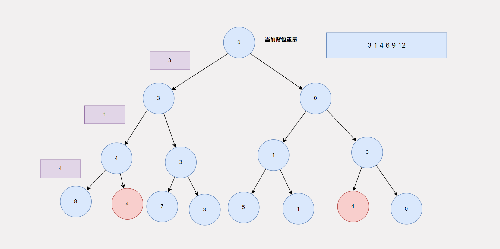

# 动态规划

算法很简单！今天我们来聊聊动态规划，我们先从动态规划怎么来的讲起，然后聊聊动态规划应该如何学？最后正式开始动态规划的学习之旅。

## 动态规划怎么就出现了呢？

存在即合理，动态规划的出现一定是为了解决一些问题的？那是解决什么样的问题呢？在我看来动态规划是一种优化手段，如果你了解过一点动态规划，就一定听说过这样一句话，“能用动态规划解决的问题，一定可以用回溯解决”。没错，在我的认知中，**动态规划是回溯的某些情况下的优化算法**。那是哪些情况呢？学过回溯之后，我们知道回溯的核心是**构建一个多阶段决策树**，树的每一层代表一个阶段，这一层的节点代表了这一层的决策选择，但是这些决策选择有可能是重复的，也有可能是冗余的，但是回溯可不管这些即便是重复的也会继续往下决策，这样就有一些重复或者冗余决策，这就导致了回溯的时间复杂度比较高。而动态规划优化的就是这类情况。即 “回溯 + 重复/冗余子状态 = 动态规划”。

到此，我们知道了回溯出现的原因，接下来就来聊聊学习动态规划的正确姿势，既然动态规划是针对某些特定情况的优化，那么只要我们能够记住这些特定的情况，那么在遇到这些特定情况的时候，就知道需要使用动态规划了。没错，就是**记特殊情况**，说的高大上一点就是**记模型**，从整体上看，这些在这些特定情况下的问题，一般都是**可行问题，计数问题，最值问题**。**可行问题**，需要我们判断某种状态是否可达。**计数问题**，需要我们给出到达某种状态有多少种可能。**最值问题**，需要我们给出到达某种状态，最大代价或者最小代价。但是在具体的模型下，这些问题的解法也有不同。我认为的模型有

1. 背包模型
2. 路径模型
3. 打家劫舍&股票买卖模型
4. 爬楼梯模型
5. 匹配模型
6. 其他模型

像我们这样的初学者，我们最应该掌握的是前5种模型，尤其是1,3,5模型，最重要的当属第一种模型，在学习具体的模型之前，我们先来看看动态规划的基本解题步骤

## 动态规划也很死板？

大致的解题步骤是这样的，如果这个问题可以用回溯解决，而且在回溯的过程中存在重复/冗余的状态就可以用动态规划。具体而言

1. 判断这道题是否可以分阶段解决
2. 画出这道题的决策树
3. 从决策树中分析出状态
4. **定义状态**
5. **给出状态转移方程**
6. 给出代码

在这6个步骤中，相对而言第4,5步是我们不熟悉，也是比较困难的，尤其对于新手而言。所谓的定义状态，就是明确在整个决策过程中，存在哪些不同的选择。而状态转移方程，表达的是当前阶段的状态如何通过之前的状态通过一定的加减乘除运算到达。虽然这两步比较困难，但是他们很固定，基本上就是上面那5个模型。所以**掌握模型，吃定动态规划**。

## 掌握好模型，动态规划不用愁？

我们应该怎样学习这些模型呢？建立映射关系并能举一反三。举个例子，比如你看到一个问题，你能够将这个问题抽象为一个模型，并记住以及理解了在这个模型下的状态的定义，以及状态转移方程的推导，然后解决这个问题。就算掌握了这个模型。所以掌握模型的秘诀就是：**不断总结，多多练习**。所谓总结就是做完一道题之后，思考一下这道题的特点，以及这道题的特点和哪个模型比较像。接下来我们来仔细看看具体的模型吧

## 掌握好背包模型，动态规划就成功了一半

需要总结出背包模型，我们需要从一些经典的题目开始。

> 假设有一个背包，可承载的最大重量为`w` 千克。现在有 `n` 个物品，每个物品的重量`weights[i]（0<=i<n）`不等并且不可分割。任选几件物品装入背包，是否能装满背包？
>
> ```shell
> 输入：
> 10
> 6
> 3 1 4 6 9 12
> 
> 输出：
> true
> 
> 解释：
> 输入的第一行为w，第二行为n，第三行为n个物体的重量
> 4+6=10 因此可以装满背包。
> ```

***

阅读这道题目，我们可以分析出这是一道**可行问题**，满足利用动态规划解题的题目第一个特点。然后我们先忘记动态规划，看看如何用回溯来解决这个问题，并简单的画出决策树。你可以动手试试，这里我先给出**我的思路**，首先我们需要知道如何分阶段，这里我选择根据物品是否被选择来分阶段，即每个阶段决策这个物品是否在背包中，然后判断一下，在放入物品之后，是否装满背包，如果知道物品决策完毕之后，也没有满足装满背包，那么就可以确定这些物品不能装满背包。我们可以根据这个思路画出一个决策树。如下图：



这里我只画了前三个阶段，可以看到当决策4这个物品放不放入背包之后，存在两个相同重量的节点，如果再往下面进行决策的话，这两个节点对应的子树一定是一样的。这个就是重复的状态。

根据前面所讲的动态规划的内容，我们知道这道题可以用回溯来解决了，那么我们就可以开始来定义状态了，定义状态，一般情况下是执行某个操作之前或者之后，某个东西的情况。就比如上面这个思路，就是在决策一个物品是否放入背包后，背包的重量。这里**背包的重量**就是我们寻找的状态。我们定义状态的时候，必须定义**完全**并需要标识这种状态是否可达。比如这里，我们的状态时背包的重量，那么粗暴一点，背包重量的取值就为：[0,n] ，即每次决策完之后，背包的重量都有[0,n]这n+1种可能，所以我们可以利用一个二维数组来表示状态，i表示第i个物品决策之后,j表示当前背包的重量，`arr[i][j]` 的值表示在第i个物品决策完之后，背包重量为j的这种状态是否可达。到此状态我们就定义完成了，接下来看看状态转移方程，即如何基于前面的状态推导出现在的状态。这里就需要根据决策来推导，通常是反推，比如这里，当我们要判断`arr[i][j]` 这个状态是否可达时，我们需要这样想，要想到达这个状态，我们能够执行的操作之后两个，一个是**选择**了第i个物品的，一个是**没有选择**第i个物品，我们可以一个一个看，我们先看选择了第i个物品后，背包的重量到达了j，那么基于的上个阶段一定是`arr[i-1][j-weight[i]]` 即上一个阶段，背包重量为`j-weight[i]` ，同理，如果没有选择第i个物品，那么一定是基于`arr[i-1][j]` 这个状态推导过来。我们通过具体的**决策操作**知道了`arr[i][j]`依赖于哪些个之前的状态。然后我们就可以看看如何根据之前的这些状态推导出现在的状态，这个要具体问题具体分析，对于这个可行的问题，推导方程当然是 `arr[i][j] = arr[i-1][j] || arr[i-1][j-weight[i]]` 即只要上一个阶段中，背包重量为j可达，或者背包重量为 j-weight[i]可达，就可以推导出当前阶段，背包重量为j可达。

总结一下上面的过程，首先我们先通过决策树知道了可以利用动态规划来解决问题，然后我们根据决策之后，某些个属性的发生了变化，而且每个阶段这些属性都会变化，比如背包重量。我们就知道了我们选择哪个属性作为状态，确定好状态之后，我们需要列举出**状态的所有的可能**。状态定义完成之后，我们可以根据具体的操作逆推当前的状态和之前哪些个状态相关，并根据题意构造出推导方程，这个推导方程就是状态转移方程。状态转移方程有一个很明显的特点，那就是一定是基于**之前的状态**（准确的说应该是已有的状态）推导过来的。

到这里呢，思路我们就梳理完毕了，那么就可以进入最后一步，写代码。

```java
public class Code01_Solve_Knapsack {

    /**
     * 定义状态 dp[i][j] :表示在第i个物品决策之后，当前背包的重量为j这个状态是否可达
     * 状态转移方程 dp[i][j] = dp[i-1][j] || dp[i-1][j-weights[i]]
     *
     * @param w
     * @param n
     * @param weights
     * @return
     */
    public boolean solveKnapsack(int w, int n, int[] weights) {
        // 定义状态
        boolean[][] dp = new boolean[n][w + 1];

        // 初始化 DONE 因为boolean值默认就是false，自动完成

        // 设置初项
        dp[0][0] = true;
        if (weights[0] <= w) {
            dp[0][weights[0]] = true;
        }

        // 填表 根据状态转移方程
        for (int i = 1; i < n; i++) {
            for (int j = 0; j <= w; j++) {
                dp[i][j] = dp[i - 1][j];
                if (j - weights[i] >= 0) {
                    dp[i][j] = dp[i][j] || dp[i - 1][j - weights[i]];
                }
            }
        }

        // 返回结果
        return dp[n - 1][w];
    }
}
```

可以看到从思路到代码还是有点不一样的，有一定的改变，不过整体的思路总是一样的。当然目前这段代码的空间复杂度还是比较高的，后面会讲解动态规划的空间优化来优化这段代码的空间复杂度。

从这段代码中我们可以总结出一个代码模板

```java
public int dpSolve(args) {
    // 定义状态
    // 初始化
    // 设置初项
    // 填表 根据状态转移方程
    // 返回结果
}
```

到此呢，背包模型就讲完了，但是背包模型还有一些变种，比如完全背包问题，有限背包问题。我讲的这个是0-1背包问题，分析思路和具体的解题套路都没有变，唯一的区别就是使用的物品个数有一定的改变，比如完全背包问题，就是使用的物品个数不限，有限背包问题就是使用的物品个数有限，0-1背包问题就是使用的物品个数只有一个。

当你理解完这道题之后，就代表你成功入门了动态规划，而且也知道了背包模型，接下来就是练习有关背包模型的相关题目了。具体如下：

[分割等和子集](https://leetcode.cn/problems/partition-equal-subset-sum/)

[目标和](https://leetcode.cn/problems/target-sum/)

[零钱兑换](https://leetcode.cn/problems/coin-change/)

[零钱兑换 II](https://leetcode.cn/problems/coin-change-ii/)

## 未完待续....

敬请期待...


