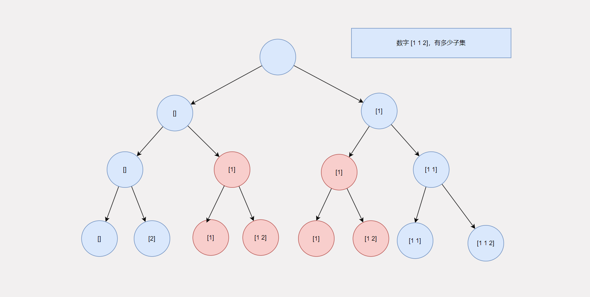

# 动态规划

动态规划，一听这个名字就觉得很高级，一定很难吧？其实不是的，我说过一切的基础算法都很简单，你觉得难，只是因为你还不够熟悉，就像刚开始学完加减法，然后口算的时候，你会觉得难，但是当你熟悉之后，你会觉得口算加减法就是一个很自然的过程。同理，动态规划也一样，只不过我们刚开始接触动态规划，觉得它很难。接下来我将通过这篇文章来消除动态规划对你而言的神秘感，让你弄懂动态规划。

## 何谓动态规划

学习动态规划之前，你得先掌握好回溯算法，如果你没有学习过回溯算法，那么这篇文章你将会看的比较吃力。我们先来回顾一下回溯算法，回溯算法：用计算机的方式解决现实世界中排列组合，枚举这类问题。而动态规划，也就是DP，是为了优化回溯算法而来的。为什么要优化回溯算法呢？因为回溯算法的时间复杂度是指数级的，在解决大规模问题的时候，这种复杂度是不允许的。而借助动态规划，利用空间换时间的思想，可以将时间复杂度降低到O(n^2)的级别。但是并不是全部的回溯算法都可以用动态规划优化的，只有在回溯时，存在重复(多余)子状态时，可以利用动态规划来优化。什么叫重复/多余的子状态呢？回溯的本质是构建一棵多阶段决策树，如果决策树某一层存在重复的状态，或者多余的状态，那么基于这一层做的下一层的决策就会存在重复或者冗余，白白浪费计算资源，而动态规划就是通过节省这部分来达到优化的目的。

比如上图这道题，在集合[1,1,2]中，它有多少个子集，通过回溯，我们枚举出所有的可能，但是其中存在重复子状态[1]于是，在下一个阶段中，就产生了重复的[1],[1,2]，而使用动态规划就是消除这些重复子状态。

## 未完待续...

